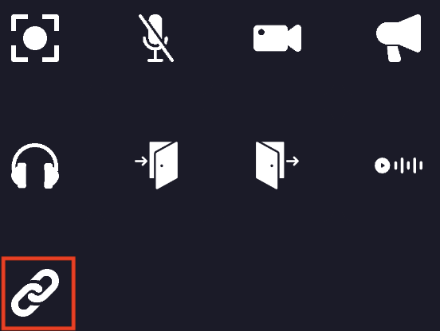

## Open link property
On your map, you can define special zones where a link will be opened when a user enters the area.

## Setting open link area :
When editing an area, you can add the silent property to it. You must click on the "link" icon.

    

        
    

1. You can define the way the action is triggered.
2. You can define the link that will be opened when the player enters the area.
3. Those settings are related to the way the action is triggered. You can choose to open the link in a new tab, or in a cowebsite, the size of the cowebsite, if it can be closed, etc ...

    

        
    

