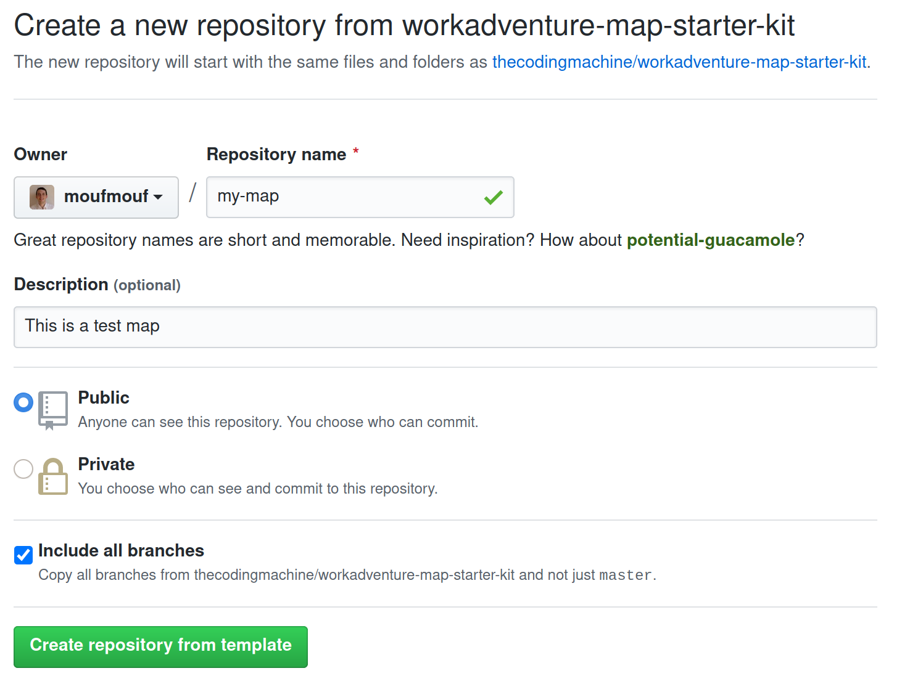
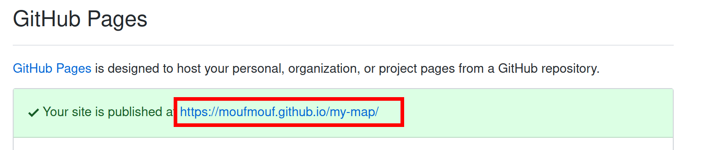
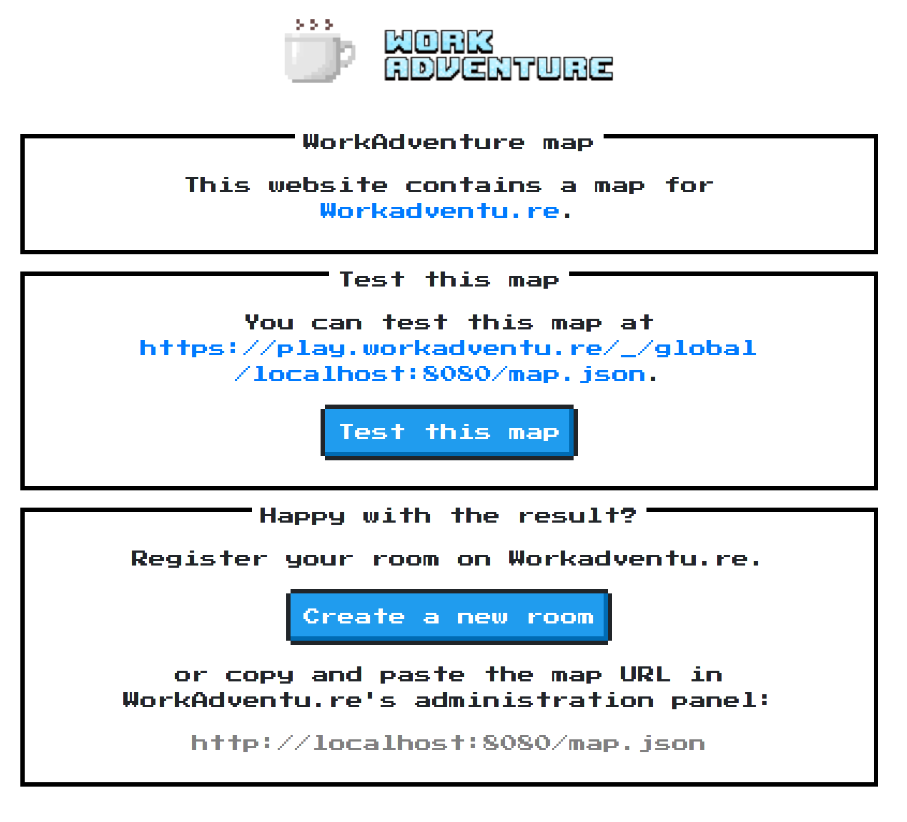

{.section-title.accent.text-primary}
# Create your map

## Tools you will need

In order to build your own map for WorkAdventure, you need:

*   the [Tiled editor](https://www.mapeditor.org/) software
*   "tiles" (i.e. images) to create your map
*   a web-server to serve your map

WorkAdventure comes with a "map starter kit" that we recommend using to start designing your map quickly. It contains **a good default tileset** for building an office and it proposes to **use Github static pages as a web-server** which is both free and performant. It also comes with a local webserver for testing purpose and with Typescript support (if you are looking to use the [map scripting API]({{url('/map-building/scripting')}}).

{.alert.alert-info}
If you are looking to host your maps on your own webserver, be sure to read the [Self-hosting your map](hosting.md) guide.

[Building your map - Create your map](https://www.youtube.com/watch?v=lu1IZgBJJD4)

## Getting started

Start by [creating a GitHub account](https://github.com/join) if you don't already have one.

Then, go to the [Github map starter kit repository page](https://github.com/thecodingmachine/workadventure-map-starter-kit) and click the **"Use this template"** button.

<figure class="figure my-5">
    
    <figcaption class="figure-caption">The "Use this template" button</figcaption>
</figure>

You will be prompted to enter a repository name for your map.

<figure class="figure my-5">
    
    <figcaption class="figure-caption">The "create a new repository" page</figcaption>
</figure>

**Make sure to check the "Include all branches" checkbox, otherwise the Github Pages deployment process will not be setup automatically.**

If you miss that step, don't worry, you can always fix that by clicking on the **Settings tab** of your repository and scroll down to the **GitHub Pages** section. Then select the **gh-pages** branch. It might already be selected, but please be sure to click on it nonetheless (otherwise GitHub will not enable GitHub pages).

{.alert.alert-info}
If you only see a "master" branch and if the **gh-pages** branch does not appear here, simply wait a few minutes and refresh your page. When you created the project, Github Actions triggered a job that is in charge of creating the **gh-pages** branch. Maybe the job is not finished yet.

<figure class="figure my-5">
    
    <figcaption class="figure-caption">The GitHub pages configuration section</figcaption>
</figure>

Wait a few minutes... Github will deploy a new website with the content of the repository. The address of the website is visible in the "GitHub Pages" section.

<figure class="figure my-5">
    
    <figcaption class="figure-caption">Your website is ready!</figcaption>
</figure>

Click on the link. You should be redirected directly to WorkAdventure, on your map!

## Customizing your map

Your map is now up and online, but this is still the demo map from the starter kit. You need to customize it.

### Cloning the map

Start by cloning the map. If you are used to Git and GitHub, simply clone the map to your computer using your preferred tool and [jump to the next chapter](#loading-the-map-in-tiled).

If you are new to Git, cloning the map means downloading the map to your computer. To do this, you will need Git, or a Git compatible tool. Our advice is to use [GitHub Desktop](https://desktop.github.com/). We recommend you take some time mastering the notion of pull / commit / push as this will make uploading your maps really easier.

As an (easier) alternative, you can simply use the "Export" button to download the code of the map in a big Zip file. When you want to upload your work again, you will simply drag'n'drop your files in the GitHub website.

### Loading the map in Tiled

The sample map is in the file `map.json`. You can load this file in [Tiled](https://www.mapeditor.org/).

Now, it's up to you to edit the map and write your own map.

Some resources regarding Tiled:

*   [Tiled documentation](https://doc.mapeditor.org/en/stable/manual/introduction/)
*   [Tiled video tutorials](https://www.gamefromscratch.com/post/2015/10/14/Tiled-Map-Editor-Tutorial-Series.aspx)

### Testing your map locally

In order to test your map, you need a webserver to host your map. The "map starter kit" comes with a local webserver that you can use to test your map.

In order to start the webserver, you will need [Node.JS](https://nodejs.org/en/). When it is downloaded, open your command line and from the directory of the map, run this command:

    $ npm install

This will install the local webserver.

    $ npm run start

This command will start the webserver and open the welcome page. You should see a page looking like this:

<figure class="figure my-5">
    
    <figcaption class="figure-caption">The welcome page of the "map start kit"</figcaption>
</figure>

From here, you simply need to click the "Test this map" button to test your map in WorkAdventure.

{.alert.alert-warning}
The local web server can only be used to test your map locally. In particular, the link will only work on your computer. You cannot share it with other people.

### Pushing the map

When your changes are ready, you need to "commit" and "push" (i.e. "upload") the changes back to GitHub. Just wait a few minutes, and your map will be propagated automatically to the GitHub pages web-server.

## Testing your map

To test your map, you need to find its URL. There are 2 kinds of URLs in WorkAdventure:

*   Test URLs are in the form `https://play.workadventu.re/_/[instance]/[server]/[path to map]`
*   Registered URLs are in the form `https://play.workadventu.re/@/[organization]/[world]/[map]`

Assuming your JSON map is hosted at "`https://myuser.github.io/myrepo/map.json`", then you can browse your map at "`https://play.workadventu.re/_/global/myuser.github.io/myrepo/map.json`". Here, "global" is a name of an "instance" of your map. You can put anything instead of "global" here. People on the same instance of the map can see each others. If 2 users use 2 different instances, they are on the same map, but in 2 parallel universes. They cannot see each other.

This will connect you to a "public" instance. Anyone can come and connect to a public instance. If you want to manage invitations, or to perform some moderation, you will need to create a "private" instance. Private instances are available in "pro" accounts.

    

        <h3 id="need-some-help">Need some help?</h3>
        
WorkAdventure is a constantly evolving project and there is plenty of room for improvement regarding map editing.

        
If you are facing any troubles, do not hesitate to open an "issue" in the
            <a href="https://github.com/thecodingmachine/workadventure/issues" target="_blank">GitHub WorkAdventure account</a>.
        

    

