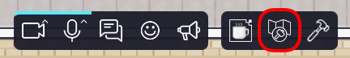

{.section-title.accent.text-primary}
# Editing maps

Welcome to the WorkAdventure map editing documentation!

This guide will provide you with instructions on how to edit and create maps for WorkAdventure, allowing you to 
customize your virtual spaces and create engaging interactive experiences. There are two primary methods for editing 
maps: using the inline editor and utilizing Tiled.

## Inline Map Editor

The inline map editor is a user-friendly tool that enables you to quickly *place objects, furniture*, and define *areas of 
interest* within your map.

In order to use the inline map editor, you must be inside your map and logged with an account that has the
"admin" or "editor" tag. The map editor icon will be visible in the action bar at the bottom of the screen.

    <figure class="figure">
        
        <figcaption class="figure-caption">Map editor icon</figcaption>
    </figure>

    <a href="./editor/access.md" class="btn btn-primary btn-red m-1 mt-3 mb-5">
        Read the map editor documentation &gt;
          </a>

## Tiled

For more extensive customization and advanced map editing, you can utilize Tiled, a powerful offline map editor. 
Tiled provides additional features such as placing floors, walls, and the ability to incorporate scripts for 
dynamic behavior.

    <a href="./build-your-map.md" class="btn btn-primary btn-red m-1 mt-3 mb-5">
        Read the map builder documentation &gt;
          </a>

## What tool should I use?

{.table}
| Task                                                                      | Recommended tool                                               |
|---------------------------------------------------------------------------|----------------------------------------------------------------|
| I want to quickly place **objects** or **furniture** (tables / chairs...) | Inline Map Editor ([entity editor](editor/entity-editor.md))   |
| I want to add **interactive objects** (computer opening a website...)     | Inline Map Editor ([entity editor](editor/entity-editor.md))   |
| I want to add **areas** of interest (exits, entries, meeting rooms...)    | Mostly Inline Map Editor ([area editor](editor/area-editor.md)) |
| I want to edit the map in **real-time**, cooperating with multiple users  | [Inline Map Editor](editor/access.md)                          |
| I want to configure global settings (Microphone...)                       | [Inline Map Editor](editor/access.md)                          |
| I want to edit **floors** and **walls**                                   | [Tiled](build-your-map.md)                                     |
| I want to create a map **from scratch**                                   | [Tiled](build-your-map.md)                                     |
| I want to write **scripts** to make the map dynamic                       | Tiled ([scripting API](scripting.md))                          |

 
 