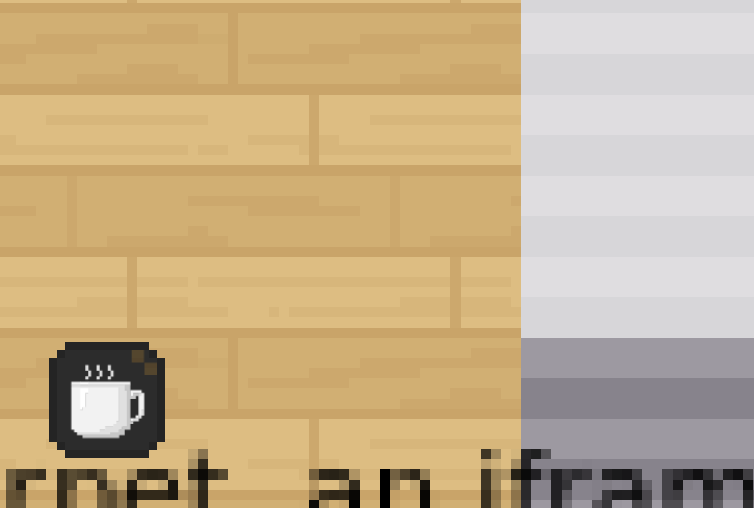

{.section-title.accent.text-primary}
# Opening a website when walking on the map

[Building your map - Opening a website](https://www.youtube.com/watch?v=Me8cu5lLN3A)

## The openWebsite property

On your map, you can define special zones. When a player will pass over these zones, a website will open (as an iframe
on the right side of the screen)

In order to create a zone that opens websites:

* You must create a specific layer.
* In layer properties, you MUST add a "`openWebsite`" property (of type "`string`"). The value of the property is the URL of the website to open (the URL must start with "https://")
* You may also use "`openWebsiteWidth`" property (of type "`int`" or "`float`" between 0 and 100) to control the width of the iframe.
* You may also use "`openTab`" property (of type "`string`") to open in a new tab instead.

{.alert.alert-warning}
A website can explicitly forbid another website from loading it in an iFrame using
the [X-Frame-Options HTTP header](https://developer.mozilla.org/en-US/docs/Web/HTTP/Headers/X-Frame-Options).

## Integrating a Youtube video

A common use case is to use `openWebsite` to open a Youtube video.

The global Youtube page cannot be embedded into an iFrame (it has the `X-Frame-Options` HTTP header).

To embed a Youtube video, be sure to **use the "embed" link**. You can get this link be clicking "Share > Embed" in Youtube.

<figure class="figure">
    
    <figcaption class="figure-caption">Find the URL of your video in the "embed Video" HTML snippet on Youtube</figcaption>
</figure>

<figure class="figure">
    
    <figcaption class="figure-caption">Put this URL in the "openWebsite" property</figcaption>
</figure>

### Triggering of the "open website" action

By default, the iFrame will open when a user enters the zone defined on the map.

It is however possible to trigger the iFrame only on user action. You can do this with the `openWebsiteTrigger` property.

If you set `openWebsiteTrigger: onaction`, when the user walks on the layer, an alert message will be displayed at the bottom of the screen:

<figure class="figure">
    
    <figcaption class="figure-caption">The iFrame will only open if the user clicks Space</figcaption>
</figure>

If you set `openWebsiteTriggerMessage: your message action` you can edit alert message displayed. If is not defined, the default message displayed is 'Press on SPACE to open the web site'.

If you set `openWebsiteTrigger: onicon`, when the user walks on the layer, an icon will be displayed at the bottom of the screen:

<figure class="figure">
    
    <figcaption class="figure-caption">The iFrame will only open if the user clicks on icon</figcaption>
</figure>

### Setting the iFrame "allow" attribute

By default, iFrames have limited rights in browsers. For instance, they cannot put their content in fullscreen, they cannot start your webcam, etc...

If you want to grant additional access rights to your iFrame, you should use the `openWebsitePolicy` property. The value of this property will be directly used for the [`allow` atttribute of your iFrame](https://developer.mozilla.org/en-US/docs/Web/HTTP/Feature_Policy/Using_Feature_Policy#the_iframe_allow_attribute).

For instance, if you want an iFrame to be able to go in fullscreen, you will use the property `openWebsitePolicy: fullscreen`

<figure class="figure">
    
    <figcaption class="figure-caption">The generated iFrame will have the allow attribute set to: <code>&lt;iframe allow="fullscreen"&gt;</code></figcaption>
</figure>

### Open a Jitsi with a co-website

Cowebsites allow you to have several sites open at the same time.

If you want to open a Jitsi and another page it's easy!

You have just to [add a Jitsi to the map](meeting-rooms.md) and [add a co-website](opening-a-website.md#the-openwebsite-property) on the same layer.

It's done!
