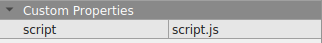

{.section-title.accent.text-primary}
# Using Typescript with the scripting API

{.alert.alert-info}
The easiest way to get started with writing scripts in Typescript is to use the 
[Github map starter kit repository](https://github.com/thecodingmachine/workadventure-map-starter-kit). It comes with 
Typescript enabled. If you are **not** using the "map starter kit", this page explains how to add Typescript to your 
own scripts.

## The short story

In this page, we will assume you already know Typescript and know how to set it up with Webpack.

To work with the scripting API in Typescript, you will need the typings of the `WA` object. These typings can be downloaded from the `@workadventure/iframe-api-typings` package.

```console
$ npm install --save-dev @workadventure/iframe-api-typings
```

Furthermore, you need to make the global `WA` object available. To do this, edit the entry point of your project (usually, it is a file called `index.ts` in the root directory).

Add this line at the top of the file:

**index.ts**
```typescript
/// <reference path="../node_modules/@workadventure/iframe-api-typings/iframe_api.d.ts" />
```

From there, you should be able to use Typescript in your project.

## The long story

Below is a step by step guide explaining how to set up Typescript + Webpack along your WorkAdventure map.

In your map directory, start by adding a `package.json` file. This file will contain dependencies on Webpack, Typescript and the Workadventure typings:

**package.json**
```json
{
  "devDependencies": {
    "@workadventure/iframe-api-typings": "^1.2.1",
    "eslint": "^7.24.0",
    "html-webpack-plugin": "^5.3.1",
    "ts-loader": "^8.1.0",
    "ts-node": "^9.1.1",
    "typescript": "^4.2.4",
    "webpack": "^5.31.2",
    "webpack-cli": "^4.6.0",
    "webpack-dev-server": "^3.11.2",
    "webpack-merge": "^5.7.3"
  },
  "scripts": {
    "start": "webpack serve --open",
    "build": "webpack --config webpack.prod.js",
  }
}
```

You can now install the dependencies:

```console
$ npm install
```

We now need to add a Webpack configuration file (for development mode). This Webpack file will:

*   Start a local webserver that will be in charge of serving the map
*   Compile Typescript into Javascript and serve it automatically

**webpack.config.js**
```js
const path = require('path');
const webpack = require('webpack');
const HtmlWebpackPlugin = require('html-webpack-plugin');

module.exports = {
    mode: 'development',
    entry: './src/index.ts',
    devtool: 'inline-source-map',
    devServer: {
        // The test webserver serves static files from the root directory.
        // It comes with CORS enabled (important for WorkAdventure to be able to load the map)
        static: {
            directory: ".",
            serveIndex: true,
            watch: true,
        },
        host: 'localhost',
        allowedHosts: "all",
        headers: {
            "Access-Control-Allow-Origin": "*",
            "Access-Control-Allow-Methods": "GET, POST, PUT, DELETE, PATCH, OPTIONS",
            "Access-Control-Allow-Headers": "X-Requested-With, content-type, Authorization"
        }
    },
    module: {
        rules: [
            {
                test: /\.tsx?$/,
                use: 'ts-loader',
                exclude: /node_modules/,
            },
        ],
    },
    resolve: {
        extensions: [ '.tsx', '.ts', '.js' ],
    },
    output: {
        filename: 'script.js',
        path: path.resolve(__dirname, 'dist'),
        publicPath: '/'
    }
};
```

We need to configure Typescript, using a `tsconfig.json` file.

**tsconfig.json**
```json
{
  "compilerOptions": {
    "outDir": "./dist/",
    "sourceMap": true,
    "moduleResolution": "node",
    "module": "CommonJS",
    "target": "ES2015",
    "declaration": false,
    "downlevelIteration": true,
    "jsx": "react",
    "allowJs": true,
    "strict": true
  }
}
```

Create your entry point (the Typescript file at the root of your project).

**src/index.ts**
```typescript
/// <reference path="../node_modules/@workadventure/iframe-api-typings/iframe_api.d.ts" />

console.log('Hello world!');
```

The first comment line is important in order to get `WA` typings.

Now, you can start Webpack in dev mode!

```console
$ npm run start
```

This will automatically compile Typescript, and serve it (along the map) on your local webserver (so at `http://localhost:8080/script.js`). Please note that the `script.js` file is never written to the disk. So do not worry if you don't see it appearing, you need to "build" it to actually write it to the disk.

Final step, you must reference the script inside your map, by adding a `script` property at the root of your map:

<figure class="figure">
    
    <figcaption class="figure-caption">The script property</figcaption>
</figure>

### Building the final script

We now have a correct development setup. But we still need to be able to build the production script from Typescript files. We are not going to use the development server in production. To do this, we will add an additional `webpack.prod.js` file.

**webpack.prod.js**
```javascript
const { merge } = require('webpack-merge');
const common = require('./webpack.config.js');

module.exports = merge(common, {
  mode: 'production',
  devtool: 'source-map'
});
```

This file will simply switch the Webpack config file in "production" mode. You can simply run:

```console
$ npm run build
```

and the `script.js` file will be generated in the `dist/` folder. Beware, you will need to move it at the root of map for it to be read by the map.
