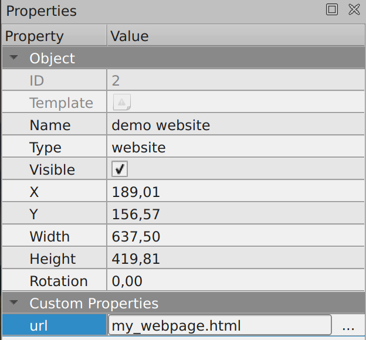
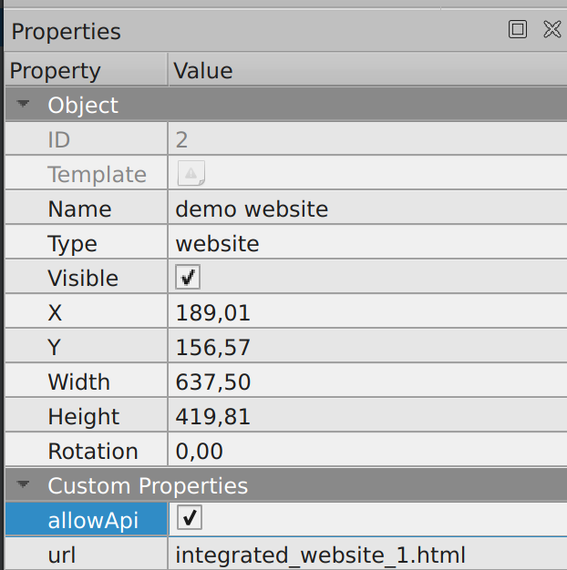

{.section-title.accent.text-primary}
# Putting a website inside a map

You can inject a website directly into your map, at a given position.

To do this in Tiled:

- Select an object layer
- Create a rectangular object, at the position where you want your website to appear
- Add a `url` property to your object pointing to the URL you want to open

    <figure class="figure">
        
        <figcaption class="figure-caption">A "website" object</figcaption>
    </figure>

The `url` can be absolute, or relative to your map.

{.alert.alert-info}
Internally, WorkAdventure will create an "iFrame" to load the website.
Some websites forbid being opened by iframes using the [`X-Frame-Options](https://developer.mozilla.org/en-US/docs/Web/HTTP/Headers/X-Frame-Options)
HTTP header.

{.alert.alert-warning}
Please note that the website always appears **on top** of the tiles (even if you put the object layer that
contains the "website" object under the tiles).

## Allowing the scripting API in your iframe

If you are planning to use the WorkAdventure scripting API inside your iframe, you need
to explicitly allow it, by setting an additional `allowApi` property to `true`.

    <figure class="figure">
        
        <figcaption class="figure-caption">A "website" object that can communicate using the Iframe API</figcaption>
    </figure>

