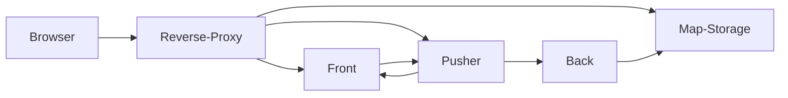
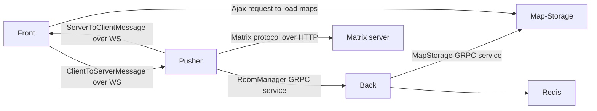

# WorkAdventure containers explained

This document explains the services that WorkAdventure is made of and the communication
between those different components.

## Reverse-proxy

The role of the reverse-proxy is to distribute web traffic to the appropriate services. Another important role
is to terminate SSL connections. It is the reverse-proxy that will handle HTTPS encoding/decoding.
The play and map-storage containers don't handle the SSL certificates themselves. It is the role of the
reverse-proxy to do so.

## Front container

The "front" container is responsible for serving HTML / JS / CSS static files.
It is a simple webserver (nginx).

## Communication between services

