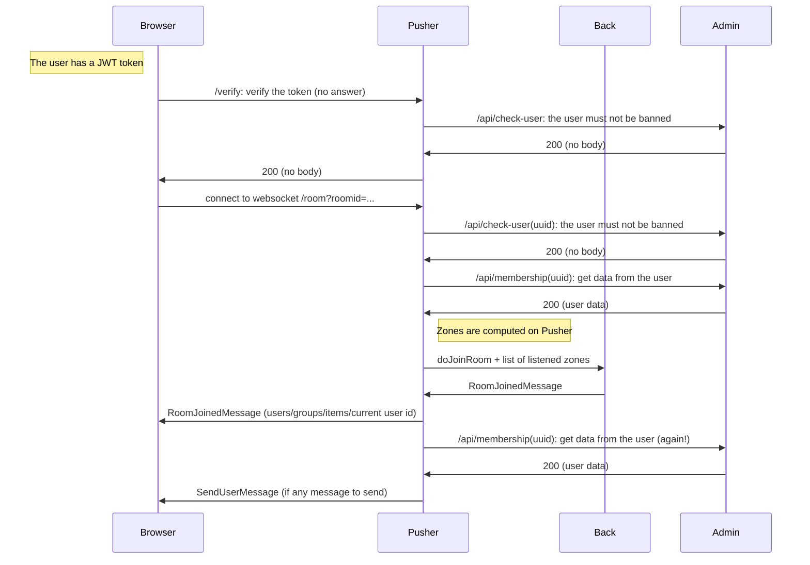

# Diagram

Diagram is rendered with "mermaid.js"

```mermaid
sequenceDiagram
    participant Br as Browser
    participant P as Pusher
    participant Ba as Back
    participant A as Admin
    Note left of Br: The user has a JWT token
    Br->>P: /verify: verify the token (no answer)
    P->>A: /api/check-user: the user must not be banned
    A->>P: 200 (no body)
    P->>Br: 200 (no body)
    Br->>P: connect to websocket /room?roomid=...
    P->>A: /api/check-user(uuid): the user must not be banned
    A->>P: 200 (no body)
    P->>A: /api/membership(uuid): get data from the user
    A->>P: 200 (user data)
    Note right of P: Zones are computed on Pusher
    P->>Ba: doJoinRoom + list of listened zones
    Ba->>P: RoomJoinedMessage
    P->>Br: RoomJoinedMessage (users/groups/items/current user id)
    P->>A: /api/membership(uuid): get data from the user (again!)
    A->>P: 200 (user data)
    P->>Br: SendUserMessage (if any message to send)
```
