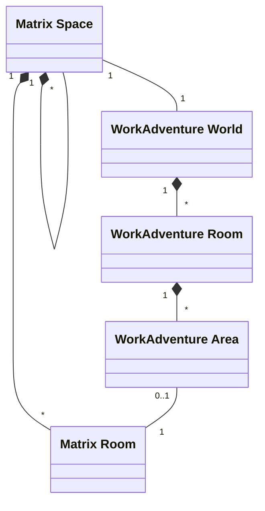
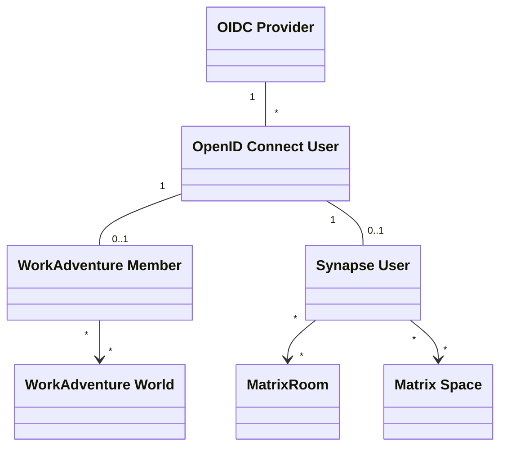
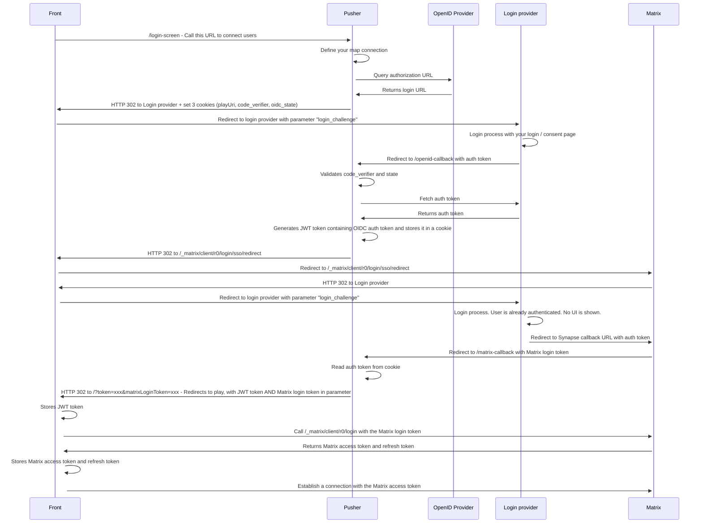
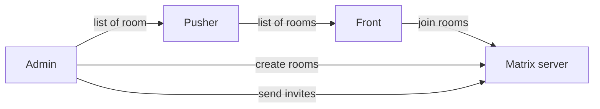
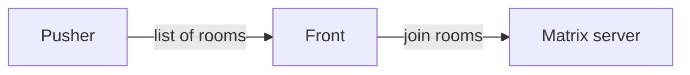
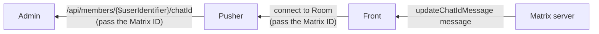
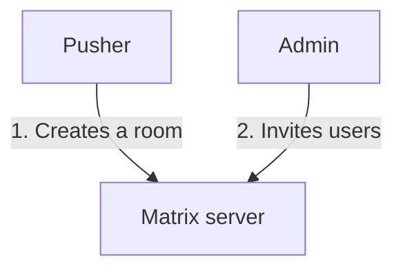

# Matrix developer notes

> [!NOTE]
> If you are looking to set up the Matrix integration with WorkAdventure, you can follow the [Matrix documentation](../self-hosting/matrix.md).

In this section, we will deep-dive into the Matrix / WorkAdventure integration implementation.

## Mapping between Matrix rooms and WorkAdventure

> [!WARNING]
> This section is work-in-progress. Matrix spaces attached to the world are not yet implemented.

A WorkAdventure world maps to a Matrix space.

> [!NOTE]
> In self-hosted versions without an admin panel, all rooms are considered to be part of the same world.

Inside this Matrix space, there are 2 kinds of Matrix rooms:

- Matrix rooms that are always visible in the rooms list
- Matrix rooms that are only visible when the user is in a specific area of the map: these Matrix rooms are automatically
  joined when the user enters the area, and automatically left when the user leaves the area. If the user does not
  properly leave the area (e.g. because of a network issue or because he closes his browser), the user is kicked out
  of the room after a timeout.

## Libraries used

The Matrix integration is used through the [matrix-js-sdk](https://github.com/matrix-org/matrix-js-sdk).

WorkAdventure relies on the new "Rust crypto" implementation of the matrix-js-sdk, so encoding does not
need the legacy Olm library.

## Login flow

The login flow to Matrix happens just  after the login to WorkAdventure.

## Detailed architecture

### With an admin

> [!WARNING]
> This section is work-in-progress and subject to change.

The admin server will send invites to the users to join the rooms.

TODO: question: do we send the invite on the fly? If yes, the front will trigger the request?

### Without an admin

> [!WARNING]
> This section is work-in-progress and subject to change.

In a configuration with no admin server, the Pusher is configured with a hard-coded list of rooms to join.

It is the responsibility of the administrator to configure those Matrix rooms to accept the users (either
by setting the room to "public" or by inviting the users).

## Matrix ID

The Matrix ID is generated by the Matrix server. In the case of Synapse, the matching between the OpenID Connect
user and the Matrix ID is done by the `user_mapping_provider` option.

It means that the "Admin" server does not know the Matrix ID of the users out of the box. The front component
is the first component to know the Matrix ID of the user. It is the front component
that will send the Matrix ID to the admin server (through the Pusher).

> [!NOTE]
> In the Admin server, the Matrix ID is therefore unknown until the user connects to the game.
> Any operation that requires the Matrix ID (such as sending an invite) must be done after the user
> has connected to the game.

The call to `/api/members/{$userIdentifier}/chatId` contains the OIDC subject (the user ID) and the Matrix ID.
On each call, the Admin server should check if the user is indeed associated to this Matrix ID.
If not, the Admin server should associate the user to that Matrix ID, and perform all required
operations (such as sending an invite to the user on whatever rooms the admin server wants
to grant access to).

> [!NOTE]
> A single Matrix ID can be associated to multiple users. Indeed, the mapping between Matrix ID
> and OIDC user is done by the Matrix server and WorkAdventure has no way to prevent the Matrix
> server to return the same Matrix ID for 2 different OIDC users. Therefore, the admin server
> should not assume that a Matrix ID can identify a single user.

The Matrix ID is sent to the back component when the user connects to the game. The back component
forwards the Matrix ID along the other user information to the other users. This way, from the
front component, you can add someone to your list of contacts by clicking on the user and
sending a Matrix invite.

## Space rooms

> [!WARNING]
> This section is work-in-progress and subject to change.

Matrix has a notion of "space rooms". These special rooms are used to group other rooms together.

If you are using an admin server, the admin server can group WorkAdventure rooms into "worlds". If you are using
a self-hosted version of WorkAdventure without an admin, all rooms are considered to be part of the same world.

WorkAdventure will maintain one "space room" per world. The space room is used to group all the Matrix rooms of the world
together.

The space room SHOULD BE created by the admin server (if you are using one). The admin server will invite all the members
to the space room.
If you are not using an admin server, it is your responsibility to create the invites to the space room for all your users.

## Types of rooms

> [!WARNING]
> This section is work-in-progress and subject to change.

Rooms attached to the space room are of 2 types:

- "map" rooms: these are valid at the map level (i.e. they are declared in the map editor in the map settings tab)
- "area" rooms: these are valid at the zone level (i.e. they are declared in the map editor in an area)

When created in Matrix, the room name is prefixed with:

- "wa-" for self-hosted servers
- "wa-[org]-[world]-" for the SAAS version

Custom state events are added to the room:

- `re.workadventu.room_type`: the room type ("map" or "area").
- `re.workadventu.tags`: the tags to enter this room (pipe separated list).

## List of rooms displayed in WorkAdventure

> [!WARNING]
> This section is work-in-progress and subject to change.

In the Matrix rooms list, WorkAdventure will make a distinction between the rooms it owns and the regular Matrix rooms.
WorkAdventure "owns" a room if the room has been created by WorkAdventure (because it was declared in the map editor).
All these rooms are children of the "space room" (see above).

In the rooms list:

- The list of "map" rooms is displayed first, sorted by name.
- The list of "area" rooms is hidden. Those are only displayed when you step on the relevant area.
- The list of regular Matrix rooms is displayed after the list of "map" rooms, in an "other rooms" section. Those are
  displayed in a tree, respecting the hierarchy of the space rooms.

> [!NOTE]
> The "map" rooms are filtered by the "tags" of the user.
> If the user does not have the required tags, the room will not be displayed.
> The user tags are compared to the `re.workadventu.tags` custom state event of the room.

## Creating a room

When a room is created in WorkAdventure, the front component sends a request to the pusher component to create the room.
The Pusher is in charge of creating the room in Matrix. It will connect to Matrix using admin credentials (user + password)
stored in the configuration.

Because of this, all rooms created by WorkAdventure will be owned by the same admin user.

The same admin credentials are used by the Admin component to invite users to the room.

# Architecture decision records

## Mapping between Matrix rooms and WorkAdventure areas

### Problem

Most of the time, for meeting rooms, we want the chat to disappear when we leave the room.
How do we achieve that?

2 solutions have been studied:

### Solution 1: Create a new Matrix room each time a new "meeting" happens

Create a new Matrix room each time a new "meeting" happens. When the last user of a WorkAdventure area leaves,
the Matrix room is "deleted" (i.e. everyone is kicked out of the room). When someone enters the area again, a new
Matrix room is created (with a new ID).
This is not ideal because in other Matrix clients (like Element), the user will see the list of rooms
he was kicked of in the "History" section of the chat.

Now, try to imagine a user entering and leaving a WorkAdventure area 10 times in a row. The user will have 10 rooms
in his history, and it will be tedious to remove them one by one.

### Solution 2: Create a single Matrix room for each WorkAdventure area

Create a single Matrix room for each WorkAdventure area. When someone enters the area, the user is invited to the
room and joins automatically. When the user leaves the area, the user is kicked out of the room.
The history settings of the area are configured to *"only members" since they joined*.

As a result, the user will only see what happens in the room since he joined the room.
If the user leaves the area and comes back, he will see the history of the room at the time he was in the room.

Let's take an example:

Alice and Bob are in the room from 2:00 PM to 3:00 PM.
Charlie and Eve are in the room from 3:00 PM to 4:00 PM.
Alice and Bob come back for a meeting in the room at 4:00 PM.

When Alice enters the room, she will see the history of the room from 2:00 PM to 3:00 PM, but she will not see
what happens between 3:00 PM and 4:00 PM. She will only see what happens after 4:00 PM.

When looking at what happens in Element, Alice will see the following:

At 2:00 PM: The room is visible in Element as a normal room
At 3:00 PM: The room disappears from the main room list and is moved to the "History" section. A click on the "History" section
does not show the content of the room and the room cannot be joined from Element (because it is private)
At 4:00 PM: The room is visible in Element as a normal room again.
