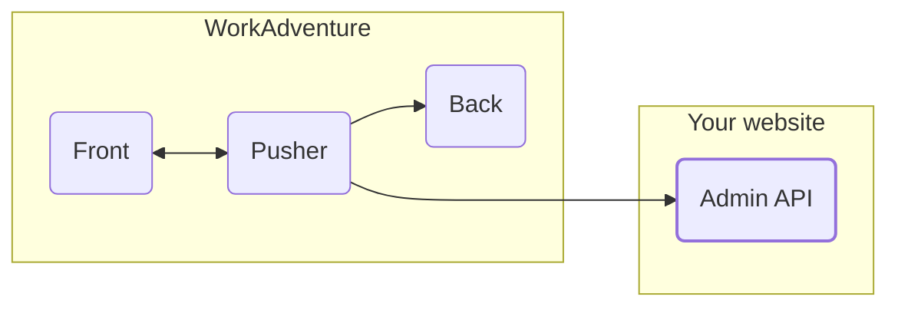
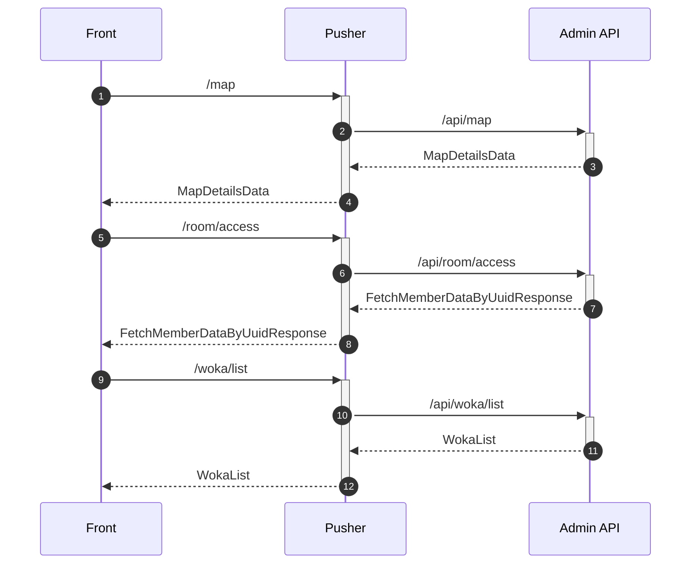

# Implement your own admin API
## Why
Create your own Admin API and connect it to WorkAdventure if:

- you want to connect WorkAdventure to your own database
- you want some of your users to have special privileges (tags)
- you want to create rooms dynamically
- you want to have "pretty URLs" for your rooms

:::caution
Be aware that WorkAdventure is licensed under "AGPL-3 restricted by the commons clause". It means in particular you are not allowed to sell a version of WorkAdventure online as a service. If in doubt, please contact us at hello@workadventu.re. We can offer special licenses depending on your use-case.
:::

## Architecture

First you need to understand how Work Adventure architecture is made.
WorkAdventure is divided in 3 sections :
- **Play**
    The play service served the game and is the one that centralizes the connections and makes exchanges through WebSocket tunnels with the clients of the Front.
    In addition, he speaks with the Back and the admin API if it's determinate.
- **Back**
    The back is the service that allows all metrics, movements, bubbles to persist.

Finally, the Admin API is the part where the members are managed. This part is fully optional.
If you are reading this documentation this is surely because you want to implement your own admin API.

## Principles
**Important!** It is not your site that will call the play service but the reverse.
The play service will directly ask your admin API for the information and authorizations it needs.

The most important endpoints are:
- `/api/map`
  _On the sequence diagram this is the call n°2._
  This end point maps the URL of the map to the map info (in particular the URL to the Tiled JSON file.
  It will process the playURI and the uuid to return the information of the map if the user can access it.
  In case of success, this endpoint returns a `MapDetailsData` object.
- `/api/room/access`
  _On the sequence diagram this is the call n°6._
  This end point returns the member's information if he can access this room.
  In case of success, this endpoint returns a `FetchMemberDataByUuidResponse` object.
- `/api/woka/list`
  _On the sequence diagram this is the call n°10._
  This end point returns a list of all the woka from the world specified.
  In case of success, this endpoint returns a `WokaList` object.

## What to do
1. You will need to implement, in your website, all the URLs that are listed in this swagger documentation : [WA Play](https://play.workadventu.re/swagger-ui/).
2. In the `.env` file :
   * Set the URL of your admin API, set the environment variable :
      `ADMIN_API_URL=http://example.com`
   * Set the token of the API to check if each request is authenticated by this token :
      `ADMIN_API_TOKEN=myapitoken`
      If the call is not correctly authenticated by the Bearer token in the header, make sure to answer with a 403 response.
