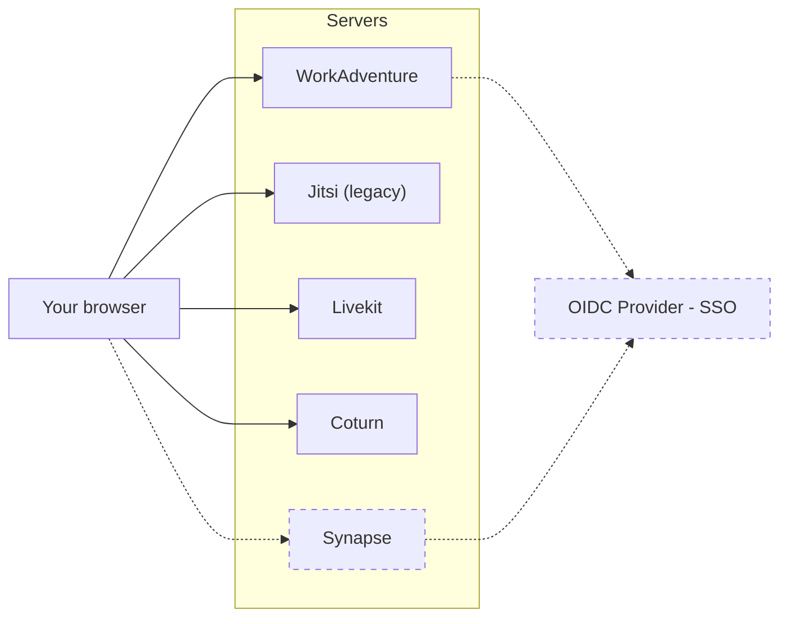

# Setting up a self-hosted production environment

## Do you need self-hosting?

WorkAdventure is a powerful and versatile platform that enables users to create immersive and interactive virtual
environments for remote collaboration, events, and games. As an open project, WorkAdventure offers users the flexibility
and freedom to host the platform on their own servers. However, self-hosting WorkAdventure requires technical expertise,
infrastructure, and maintenance, which may not be feasible or practical for all users.

In order to self-host WorkAdventure, you will need:

- at least one server for WorkAdventure, with a public facing IP and a DNS name
- in addition, WorkAdventure requires to have 2 additional services: Jitsi and Coturn. In a typical setup, those services will be hosted on 2 additional servers (both with a public facing IP address and a DNS name)
- a strong technical expertise regarding Docker and containers
- a good understanding of networking concepts
- ... and time (!), to keep up with the updates (about once a month)

Depending on your use-case, you might want to check the SAAS (i.e. hosted) version of WorkAdventure.
It provides:

- **Fast and easy setup**: with just a few clicks, you can sign up, create your first virtual space, invite your team or friends, and start exploring and collaborating in real-time
- **Automatic upgrades**: you don't have to worry about upgrading the platform yourself. WorkAdventure is a fast-evolving
  technology, with frequent updates, bug fixes, and new features. The SAAS version takes care of all the upgrades and ensures that you always have access to the latest and greatest version of the platform.
- **An advanced dashboard**: you can manage your virtual spaces, users, and get fine-grained access rights from the dashboard.
  You can also create and manage your own custom domains and logos.
- **Lower costs and resources**: While self-hosting WorkAdventure may seem like a cost-effective option at first glance,
  it can quickly become expensive and resource-intensive in the long run. Self-hosting requires not only server hardware
  but also bandwidth, storage, and maintenance costs. Moreover, self-hosting requires technical expertise, time, and
  effort to set up, configure, and troubleshoot the infrastructure. The SAAS version of WorkAdventure, on the other hand,
  offers a pay-as-you-go pricing model that scales with your usage and needs. You only pay for what you use (no need for those costly video servers),
  and you don't have to worry about upfront investments, hidden fees, or unpredictable costs. And most importantly,
  you contribute to making WorkAdventure a sustainable product 👍

Also, the WorkAdventure SAAS version provides a generous free-plan. Head over at https://workadventu.re to start right away.

Still interested in self-hosting? All right! Read below.

## A high level view of a WorkAdventure environment

In order to host WorkAdventure you will need to host:

- **WorkAdventure** itself
- **Coturn**: this is a service that proxies the WebRTC video signal in case a user is on a network that does not allow
  peer-to-peer connections. Coturn is optional, but without Coturn, approximately 15% of the users will fail to establish
  a audio/video connection.
- **Livekit**: in large bubbles / meeting rooms (>4 people), Livekit is used to broadcast video streams to all users.
- **Jitsi (legacy)**: in large meeting rooms, Jitsi is used to broadcast video streams to all users.
- **OIDC Provider** (optional): this is the service that authenticates users. It is optional as you can run a WorkAdventure
  instance with only anonymous users.
- **Synapse**: this is the server that hosts the Matrix chat rooms. It is optional.

> [!WARNING]  
> In the rest of this document, we will describe how to install the WorkAdventure server. We will leave Livekit, Jitsi,
> Coturn and Synapse installs out of scope. OpenID Connect authentication is also out of scope for now.

Livekit install guide: https://docs.livekit.io/home/self-hosting/deployment/  
Jitsi install guide: https://jitsi.github.io/handbook/docs/devops-guide/  
Coturn install guide: https://meetrix.io/blog/webrtc/coturn/installation.html  
Synapse install guide: https://element-hq.github.io/synapse/latest/setup/installation.html

## Installation method for the WorkAdventure server

WorkAdventure is a set of different programs. There are countless ways of hosting WorkAdventure. In the past, we have
seen people using Ansible, NixOS or Kubernetes to host WorkAdventure. You can host each component on a different
domain name or run a "single-domain" install. The core maintainers of this project cannot possibly support all possible
installation methods.

So we are maintaining TWO installation methods:

1. using Docker Compose
2. using Kubernetes (Helm chart)

### Docker Compose

The easiest way to install WorkAdventure if you do not have a Kubernetes cluster is to use Docker Compose.

- **WorkAdventure works as a set of Docker containers.**
- **We provide Docker images for each container in the Docker hub registry, and a docker-compose file to easily start the containers.**
- **The proposed install runs on a single domain (you will still need 2 additional domain names for Jitsi and Coturn).**
- **We assume you have one physical server with root access and Docker installed. The server has a public IP address.**

The installation below is well tested on each release and is known to work.

Of course, every production environment is different and this docker-compose file will not
fit all use cases. The file is yours. Fill free to modify it. Fill free to use it as a starting point to host the
solution on Kubernetes if you want.

If you have specific needs for a custom deployment, the WorkAdventure company can offer paid support. Don't hesitate to
contact us at hello@workadventu.re. We also provide support to integrate WorkAdventure in your existing application.

Click here to see the [Docker Compose install guide](../../../contrib/docker/README.md).

### Helm chart for Kubernetes

If you have a Kubernetes cluster, you can use the Helm chart to install WorkAdventure.

The Helm Chart is well tested on each release and is known to work.
It is newer than the Docker Compose install and might change more frequently in the coming month. Therefore,
we do not (yet) guarantee the absence of breaking changes between minor versions.

Click here to see the [Helm chart install guide](../../../contrib/helm/README.md).

### Alternative installation methods

For any question related to non-standard deployments, you can ask the community on the "server-sorcery" Discord
channel: 
