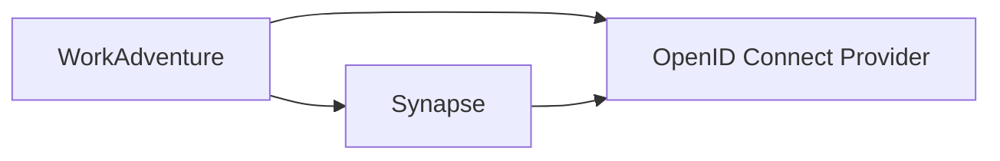

# Matrix integration

WorkAdventure can be integrated with a Matrix server to provide a chat in the game.
In order to do so, you will first need to set up OpenID Connect authentication on both [WorkAdventure](openid.md) and your Matrix server.

We have tested this integration with [Synapse](https://matrix-org.github.io/synapse/latest/).

## Architecture

Both WorkAdventure and Synapse must be configured to use the same OpenID Connect provider.



> [!NOTE]  
> Matrix is migrating to OpenID native clients. To do this, Synapse supports a new service named
> [Matrix Authentication Service (MAS)](https://github.com/matrix-org/matrix-authentication-service). This service
> (and Synapse configured with the "experimental_features.msc3861" option) is not yet supported by WorkAdventure.
> Instead, you should configure Synapse with the classic "sso" option (see below).

## Synapse configuration

### OpenID Connect provider

Follow the documentation at https://matrix-org.github.io/synapse/latest/openid.html to configure Synapse with your OpenID Connect provider.

> [!WARNING]
> You will set up 2 different "applications" in your OpenID Connect provider: one for WorkAdventure and one for Synapse.
> Each application must have its own client ID, client secret and redirect URI.  
> Do not use the same client ID for both applications.

Some important parts of the configuration are:

Depending on your OpenID Connect provider, you will need to use the `user_mapping_provider` option to map the OpenID Connect users to a Matrix user ID.
The hardest part is finding the right value for the _local part_ of the identifier. This is the part before the `:` in the Matrix user ID (e.g. `@localpart:matrix.org`).

For example, if your OpenID Connect provider returns the `email` claim, you can use the following configuration:

```
oidc_providers:
  - idp_id: <some-id>
    idp_name: <some-name>
    issuer: "https://<provider-url>"

    # Use skip_verification if your OpenID Connect provider is not using a valid certificate or is using HTTP instead of HTTPS.
    # skip_verification: true
    client_id: "<client-id>"
    client_secret: "<client-secret>"
    scopes: ["openid", "email", "profile"]

    # In case your OpenID Connect provider does not provide the claims in the ID token, but only provides them in the userinfo endpoint, use the option below:
    # user_profile_method: "userinfo_endpoint"

    user_mapping_provider:
      config:
        # Here, we are using the beginning of the email as the local part of the Matrix user ID.
        # For example, if the email is "john.doe@example", the local part will be "john.doe".
        # You can customize this to your needs.
        localpart_template: "{{ user.email.split('@')[0] }}"
        display_name_template: "{{ user.name }}"
        email_template: "{{ user.email }}"
```

Use the `sso.client_whitelist` option to skip the Matrix "Continue to your account" page.
You should whitelist the URL of your WorkAdventure instance. Don't forget to end the URL with a `/`.

```
sso:
  client_whitelist:
    # Replace the URL below with the URL of your WorkAdventure instance. Don't forget the trailing slash.
    - http://play.workadventure.localhost/
```

### Administrator

In addition to providing the OpenID Connect configuration, you will need to provide an administrator user to the WorkAdventure
integration. This user will be used by WorkAdventure to create rooms and invite users to those rooms.

You can create a new user in Synapse using the `register_new_matrix_user` script:

```
register_new_matrix_user -u @admin-wa:myserver.com -p mypassword -c /etc/matrix-synapse/homeserver.yaml -a http://localhost:8008
```

See https://manpages.debian.org/testing/matrix-synapse/register_new_matrix_user.1.en.html

### Configuring WorkAdventure to point to the Synapse server

#### With docker-compose

If you are using docker-compose to start WorkAdventure, you can set the following environment variables in your `.env` file:

```
# The internal URL of the Matrix server. This is the URL that the WorkAdventure server will use to communicate with the Matrix server.
# If your Matrix server is running on the same Docker host as WorkAdventure, you can use the container name as the hostname.
# If your Matrix server is running out of Docker, use the full URL.
MATRIX_API_URI=
# The public URL of the Matrix server. This is the URL that the WorkAdventure clients will use to communicate with the Matrix server.
MATRIX_PUBLIC_URI=
# A valid Matrix user that will be used to create rooms and invite users.
MATRIX_ADMIN_USER=
MATRIX_ADMIN_PASSWORD=
```

#### With the Helm chart

If you are using the Helm chart to deploy WorkAdventure, you can set the following values in your `values.yaml` file:

**values.yaml**

```yaml
play:
  env:
    # The internal URL of the Matrix server. This is the URL that the WorkAdventure server will use to communicate with the Matrix server.
    # If your Matrix server is running on the same Kubernetes namespace as WorkAdventure, you can use the service name as the hostname.
    # If your Matrix server is running out of the Kubernetes namespace, use the full URL.
    MATRIX_API_URI: ""
    # The public URL of the Matrix server. This is the URL that the WorkAdventure clients will use to communicate with the Matrix server.
    MATRIX_PUBLIC_URI: ""
    # A valid Matrix user that will be used to create rooms and invite users.
    MATRIX_ADMIN_USER: ""
  secretEnv:
    MATRIX_ADMIN_PASSWORD: ""
```

## Developer notes

If you are looking for a developer description of the WorkAdventure / Matrix integration, you can find it in the
[Matrix developer notes](../contributing/matrix-dev.md).
