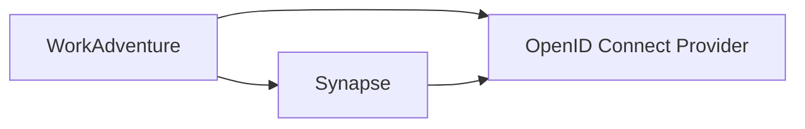
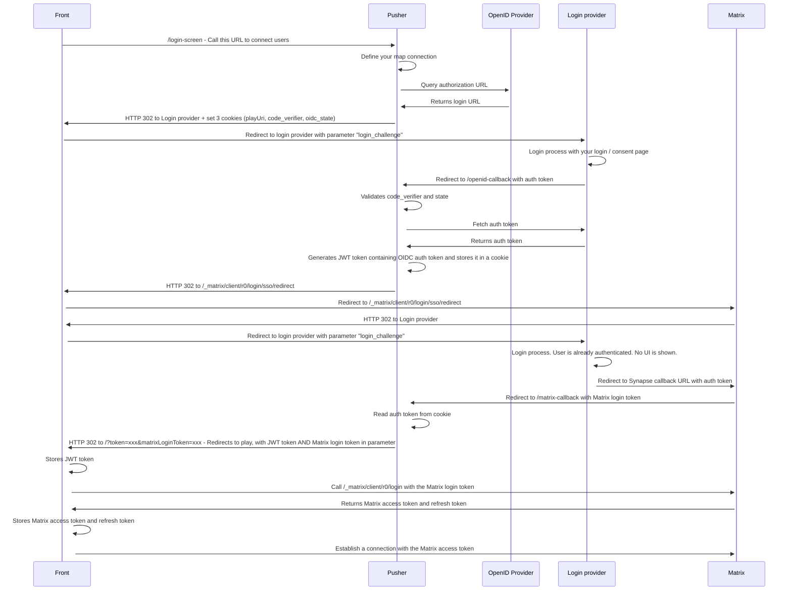
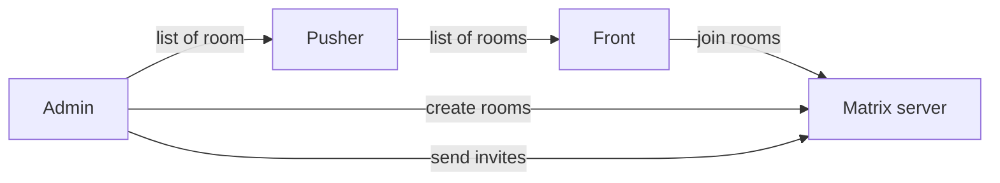
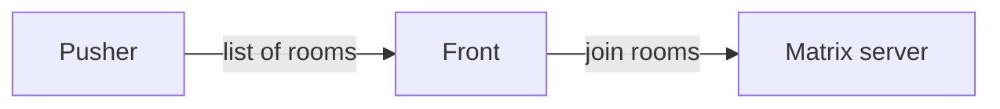
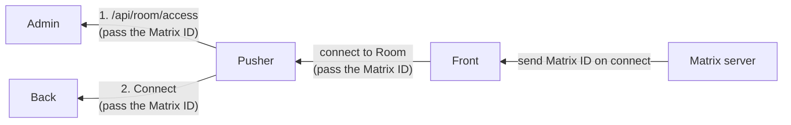
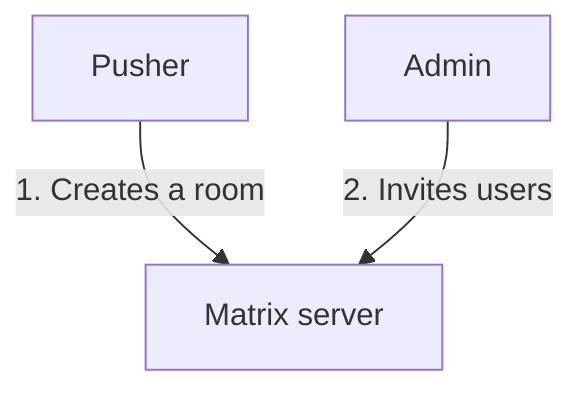

# Matrix integration

WorkAdventure can be integrated with a Matrix server to provide a chat in the game.
In order to do so, you will first need to set up OpenID Connect authentication on both [WorkAdventure](openid.md) and your Matrix server.

We have tested this integration with [Synapse](https://matrix-org.github.io/synapse/latest/).

## Architecture

Both WorkAdventure and Synapse must be configured to use the same OpenID Connect provider.



> [!NOTE]  
> Matrix is migrating to OpenID native clients. To do this, Synapse supports a new service named
> [Matrix Authentication Service (MAS)](https://github.com/matrix-org/matrix-authentication-service). This service
> (and Synapse configured with the "experimental_features.msc3861" option) is not yet supported by WorkAdventure.
> Instead, you should configure Synapse with the classic "sso" option (see below).


## Synapse configuration

### OpenID Connect provider

Follow the documentation at https://matrix-org.github.io/synapse/latest/openid.html to configure Synapse with your OpenID Connect provider.

Some important parts of the configuration are:

Depending on your OpenID Connect provider, you will need to use the `user_mapping_provider` option to map the OpenID Connect users to a Matrix user ID.
The hardest part is finding the right value for the _local part_ of the identifier. This is the part before the `:` in the Matrix user ID (e.g. `@localpart:matrix.org`).

For example, if your OpenID Connect provider returns the `email` claim, you can use the following configuration:

```
oidc_providers:
  - idp_id: <some-id>
    idp_name: <some-name>
    issuer: "https://<provider-url>"
    
    # Use skip_verification if your OpenID Connect provider is not using a valid certificate or is using HTTP instead of HTTPS.
    # skip_verification: true
    client_id: "<client-id>"
    client_secret: "<client-secret>"
    scopes: ["openid", "email", "profile"]

    # In case your OpenID Connect provider does not provide the claims in the ID token, but only provides them in the userinfo endpoint, use the option below:
    # user_profile_method: "userinfo_endpoint"

    user_mapping_provider:
      config:
        # Here, we are using the beginning of the email as the local part of the Matrix user ID.
        # For example, if the email is "john.doe@example", the local part will be "john.doe".
        # You can customize this to your needs.
        localpart_template: "{{ user.email.split('@')[0] }}"
        display_name_template: "{{ user.name }}"
        email_template: "{{ user.email }}"
```        

Use the `sso.client_whitelist` option to skip the Matrix "Continue to your account" page.
You should whitelist the URL of your WorkAdventure instance. Don't forget to end the URL with a `/`.

```
sso:
  client_whitelist:
    - http://play.workadventure.localhost/
```

### Administrator

In addition to providing the OpenID Connect configuration, you will need to provide an administrator user to the WorkAdventure
integration. This user will be used by WorkAdventure to create rooms and invite users to those rooms.

You can create a new user in Synapse using the `register_new_matrix_user` script:

```
register_new_matrix_user -u @admin-wa:myserver.com -p mypassword -c /etc/matrix-synapse/homeserver.yaml -a http://localhost:8008
```

See https://manpages.debian.org/testing/matrix-synapse/register_new_matrix_user.1.en.html

The admin user login and password will be stored in the WorkAdventure environment variables:

- `MATRIX_ADMIN_USER`
- `MATRIX_ADMIN_PASSWORD`

## Developer notes

In this section, we will deep-dive into the Matrix / WorkAdventure integration implementation.

### Libraries used

The Matrix integration is used through the [matrix-js-sdk](https://github.com/matrix-org/matrix-js-sdk).

WorkAdventure relies on the new "Rust crypto" implementation of the matrix-js-sdk, so encoding does not
need the legacy Olm library.

### Login flow

The login flow to Matrix happens just  after the login to WorkAdventure.



### Detailed architecture

#### With an admin

The admin server is in charge of providing a UI to create/manage Matrix rooms.
The admin server will send invites to the users to join the rooms.

TODO: question: do we send the invite on the fly? If yes, the front will trigger the request?



#### Without an admin

In a configuration with no admin server, the Pusher is configured with a hard-coded list of rooms to join.



It is the responsibility of the administrator to configure those Matrix rooms to accept the users (either
by setting the room to "public" or by inviting the users).

### Matrix ID

The Matrix ID is generated by the Matrix server. In the case of Synapse, the matching between the OpenID Connect
user and the Matrix ID is done by the `user_mapping_provider` option.

It means that the "Admin" server does not know the Matrix ID of the users out of the box. The front component
is the first component to know the Matrix ID of the user. It is the front component
that will send the Matrix ID to the admin server (through the Pusher).



> [!NOTE]
> In the Admin server, the Matrix ID is therefore unknown until the user connects to the game.
> Any operation that requires the Matrix ID (such as sending an invite) must be done after the user
> has connected to the game.

The call to `/api/room/access` contains the OIDC subject (the user ID) and the Matrix ID.
On each call, the Admin server should check if the user is indeed associated to this Matrix ID.
If not, the Admin server should associate the user to that Matrix ID, and perform all required
operations (such as sending an invite to the user on whatever rooms the admin server wants
to grant access to).

> [!NOTE]
> A single Matrix ID can be associated to multiple users. Indeed, the mapping between Matrix ID
> and OIDC user is done by the Matrix server and WorkAdventure has no way to prevent the Matrix
> server to return the same Matrix ID for 2 different OIDC users. Therefore, the admin server 
> should not assume that a Matrix ID can identify a single user. 

The Matrix ID is sent to the back component when the user connects to the game. The back component
forwards the Matrix ID along the other user information to the other users. This way, from the
front component, you can add someone to your list of contacts by clicking on the user and
sending a Matrix invite.


### Space rooms

Matrix has a notion of "space rooms". These special rooms are used to group other rooms together.

If you are using an admin server, the admin server can group WorkAdventure rooms into "worlds". If you are using
a self-hosted version of WorkAdventure without an admin, all rooms are considered to be part of the same world.

WorkAdventure will maintain one "space room" per world. The space room is used to group all the Matrix rooms of the world
together.

The space room SHOULD BE created by the admin server (if you are using one). The admin server will invite all the members
to the space room.
If you are not using an admin server, it is your responsibility to create the invites to the space room for all your users.

### Types of rooms

Rooms attached to the space room are of 2 types:

- "map" rooms: these are valid at the map level (i.e. they are declared in the map editor in the map settings tab)
- "area" rooms: these are valid at the zone level (i.e. they are declared in the map editor in an area)

When created in Matrix, the room name is prefixed with:

- "wa-" for self-hosted servers
- "wa-[org]-[world]-" for the SAAS version

Custom state events are added to the room:

- `re.workadventu.room_type`: the room type ("map" or "area").
- `re.workadventu.tags`: the tags to enter this room (pipe separated list).


### List of rooms displayed in WorkAdventure

In the Matrix rooms list, WorkAdventure will make a distinction between the rooms it owns and the regular Matrix rooms.
WorkAdventure "owns" a room if the room has been created by WorkAdventure (because it was declared in the map editor).
All these rooms are children of the "space room" (see above).

In the rooms list:

- The list of "map" rooms is displayed first, sorted by name.
- The list of "area" rooms is hidden. Those are only displayed when you step on the relevant area.
- The list of regular Matrix rooms is displayed after the list of "map" rooms, in an "other rooms" section. Those are
  displayed in a tree, respecting the hierarchy of the space rooms.

> [!NOTE]
> The "map" rooms are filtered by the "tags" of the user.
> If the user does not have the required tags, the room will not be displayed.
> The user tags are compared to the `re.workadventu.tags` custom state event of the room.

### Creating a room

When a room is created in WorkAdventure, the front component sends a request to the pusher component to create the room.
The Pusher is in charge of creating the room in Matrix. It will connect to Matrix using admin credentials (user + password)
stored in the configuration.

Because of this, all rooms created by WorkAdventure will be owned by the same admin user.

The same admin credentials are used by the Admin component to invite users to the room.




### Adding attachments to a message

As I am writing this (Jan. 2024), there is not yet a way to remove attachments from a room (see https://github.com/matrix-org/matrix-spec/issues/226)

Since a lot of attachments will be video / audio messages (potentially big), it is important to have a way to remove
those or have an expiry date on those. Therefore, WorkAdventure stores attachments in a separate service, using the 
"uploader" component. After, the files are linked to the message using a "content URI" (see https://matrix.org/docs/spec/client_server/r0.6.1#m-file,
or https://matrix.org/docs/spec/client_server/r0.6.1#m-faudio ...).


