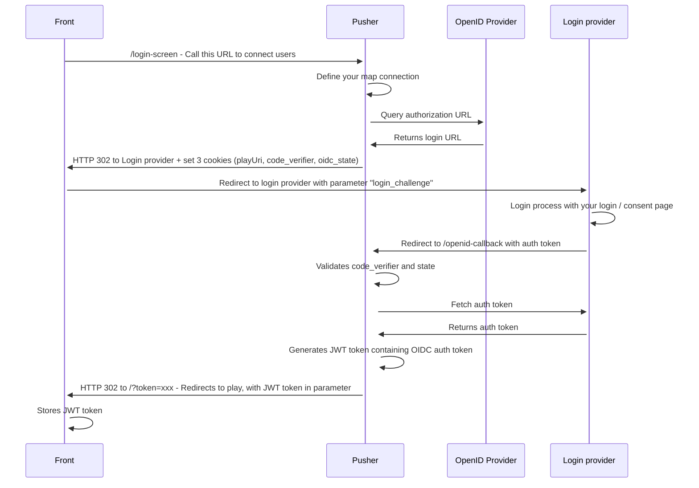
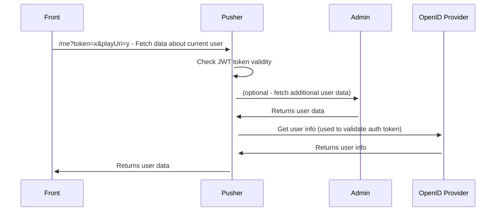

# OpenID connect

WorkAdventure can be connected to any OpenID Connect compliant provider.

It uses the Authorization Code flow and supports PKCE.

To configure WorkAdventure with your OpenID Connect provider, you first need to declare
WorkAdventure as an application in your OpenID Connect provider.

The way you do this depends on the provider.

As part of this configuration, you will need to configure the "redirect URL".

For WorkAdventure, the redirect URL is: `https://play.[your-domain]/openid-callback`.

Then, you need to configure these environment variables:

- `OPID_CLIENT_ISSUER` (*play container*): the full URL to your OpenID Connect provider
- `OPID_CLIENT_ID` (*play container*): the ID of the OpenID client that you created in the OpenID Connect provider
- `OPID_CLIENT_SECRET` (*play container*): the secret of the OpenID client that you created in the OpenID Connect provider
- `OPID_PROMPT` (*play container*): whether the Authorization Server prompts the End-User for reauthentication and consent. Used as the [`prompt` parameter of the authentication request](https://openid.net/specs/openid-connect-core-1_0.html#AuthRequest) (Default: empty)

There are additional environment variables which can be used to configure the OpenID login process further:
- `OPID_USERNAME_CLAIM` (*play container*): the claim attribute to be used as the username on login. (Default: username)
- `OPID_LOCALE_CLAIM`: (*play container*): the claim attribute to use used as the locale on login. (Default: locale)
- `OPID_SCOPE`: (*play container*): the OpenID scope identifiers to use (Default: openid email)

## Complete flow

For developers, here is the complete flow:

**Login diagram**

**Page loading diagram**

