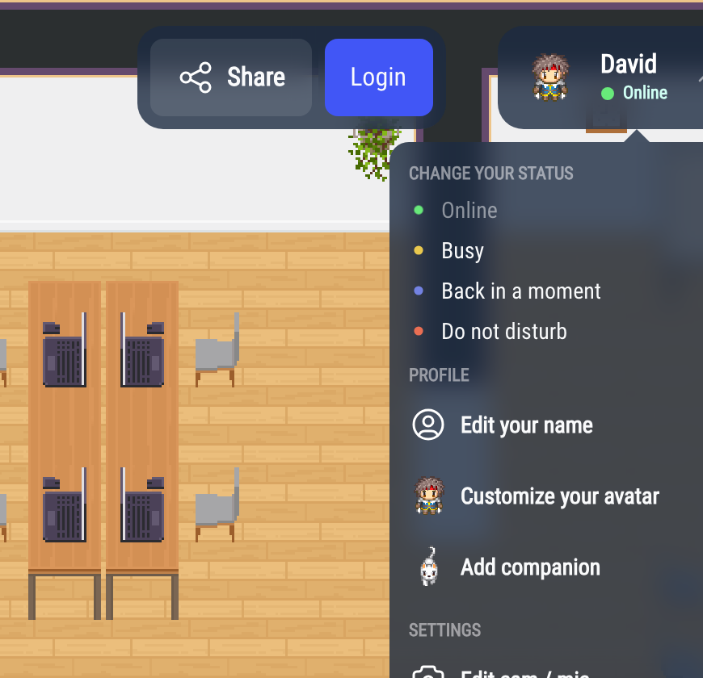
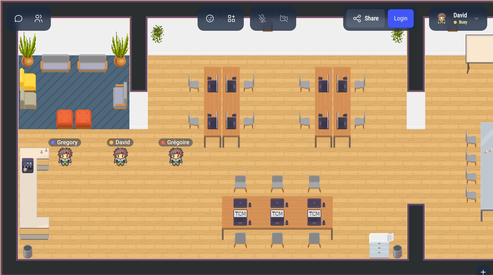
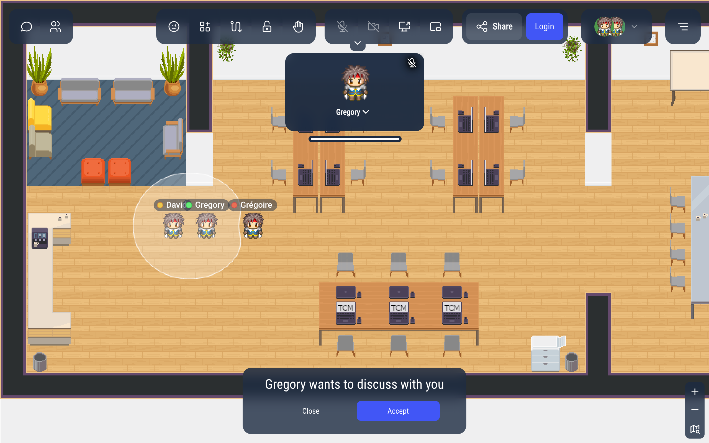
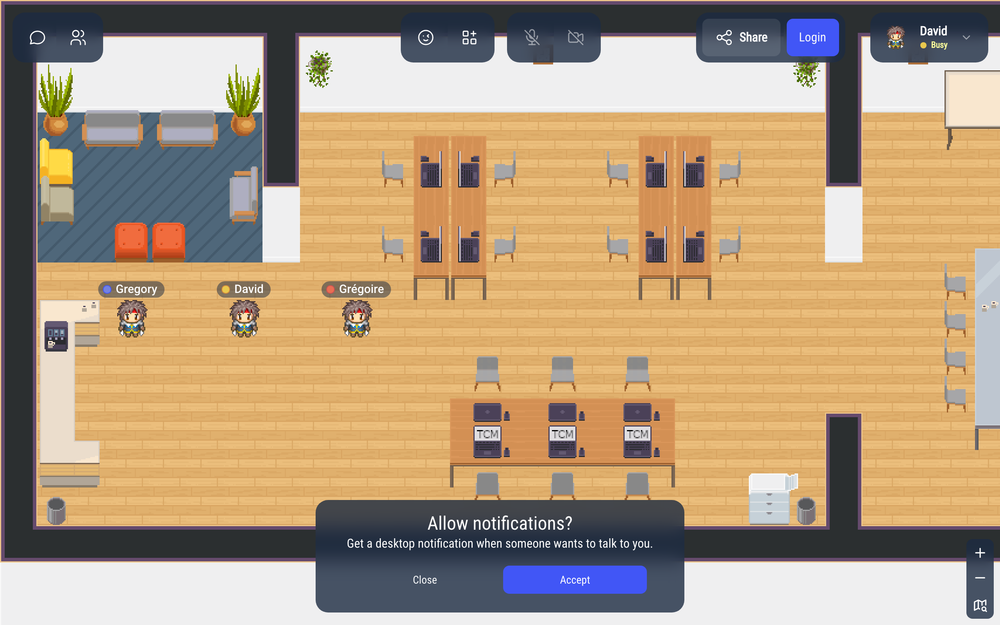

# Your availability status

Your status tells the others whether they can come and talk to you. It is shown as a colored dot next to your name.

## Changing your status

Click your name in the top-right corner. The **Change your status** section lists the statuses you can choose:

- **Online**: you are available.
- **Busy**: you are working, but people can still come to you.
- **Back in a moment**: you are away from your desk for a short while.
- **Do not disturb**: nobody should disturb you.

Your status stays the same when you reload the page.

As soon as you move your Woka, your status goes back to **Online**.

## What each status does

| | Online | Busy | Back in a moment | Do not disturb |
|---|---|---|---|---|
| Color of the dot | green | yellow | blue | red |
| People can start a bubble with you | yes | yes, and you are asked first | no | no |
| Your camera and microphone | as you set them | off | off | off |
| Sounds (bubble, megaphone) | on | on | off | off |
| Reminder to go back online | no | after 1 hour | after 1 hour | after 4 hours |

While your status is **Busy**, **Back in a moment** or **Do not disturb**, the camera and microphone buttons are greyed out. When you go back to **Online**, your camera and microphone return to how you left them.

### When you are Busy

People can still walk up to you and start a bubble, but your camera and microphone stay off. A message tells you who wants to talk:

- **Accept**: you go back to **Online**, your camera and microphone come back, and you can talk.
- **Close**: you stay **Busy** in the bubble, with your camera and microphone off.

The first time you choose **Busy**, WorkAdventure asks **Allow notifications?** to warn you with a desktop notification when someone wants to talk to you while you are in another tab. Click **Accept**, then allow notifications in your browser.

### Going back online

After 1 hour in **Busy** or **Back in a moment**, or 4 hours in **Do not disturb**, WorkAdventure asks **Do you want to go back online?**. Click **Confirm** to go back to **Online**, or **Close** to keep your status (you will be asked again later).

## Automatic statuses

WorkAdventure also sets some statuses for you. While one of them is active, you cannot change your status by hand.

- **Away**: you switched to another window or tab, and you are not in a conversation. Your status comes back as soon as you return. Whether your camera and microphone stay on while you are away is set in the [Settings](/user/settings#away-mode). A status you chose by hand (like **Busy**) is shown instead of **Away**.
- **In a meeting**: you are in a meeting room, a Jitsi or BigBlueButton room, on a podium, or in its audience.
- **Silent**: you are in a silent zone of the map.
- **Not available**: the map does not let you talk to people.
- **Sound blocked**: your browser blocks the sound until you click on the page. A message says "Your browser blocked audio playback": click **Turn sound on**, or anywhere on the page.

When the automatic status ends, the status you chose comes back.

## What the others see

Your colored dot appears next to your name on the map, and in the user list. When someone clicks your Woka, they also see the name of your status.

:::info Microsoft Teams
If your administrator connected WorkAdventure to Microsoft Teams, your status can be synchronized with your Teams presence, in one or both directions (see [Microsoft Teams](/admin/integrations/microsoft-teams/ms-teams#presence-synchronization)).
:::
