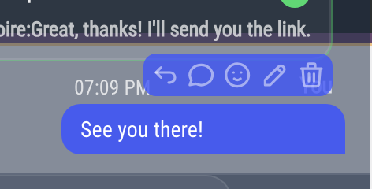
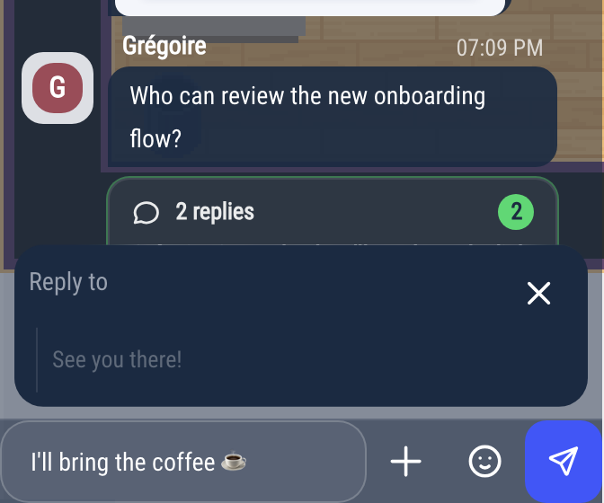
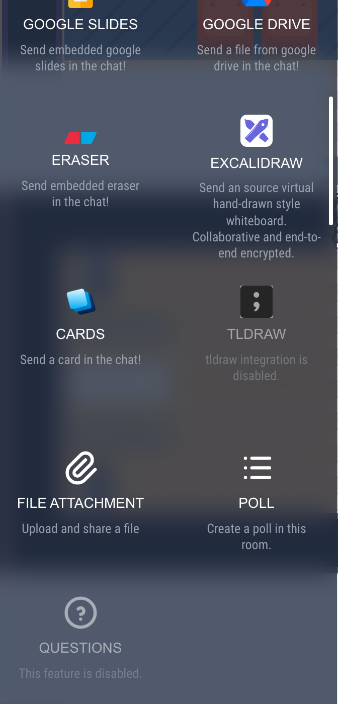

# Writing messages

This page explains what you can do with messages: write, reply, react, edit, start a thread, share files and apps.
For the two kinds of chat (proximity chat and chat rooms) and how to create a room, see [Using the chat](chat.md).

## Writing a message

Type in **Enter your message...** at the bottom of the chat:

- **Enter** sends the message, **Shift + Enter** starts a new line.
- The smiley button opens the emoji picker.
- You can format your text with Markdown: `**bold**`, `*italic*`, `` `code` ``, lists, and code blocks between three backticks.
- Clicking a link to another website opens it next to the map when the site allows it, otherwise in a new tab. Hold **Ctrl** (**Cmd** on a Mac) to open it in a new tab.

While someone is typing, their picture appears at the bottom of the conversation, with three moving dots.

A message you started but did not send is kept: you find it again when you come back to the room.

## Actions on a message

:::info
These actions exist in chat rooms only. In the proximity chat, messages cannot be replied to, edited, deleted or reacted to.
:::

Hover over a message to show its actions, from left to right:

- **Reply**: your message is sent with the original message quoted inside it. A **Reply to** banner shows the message you answer; click ✕ to cancel.
- **Thread** (**Open thread**): starts or opens a side conversation on this message (see [Threads](#threads)).
- **React**: adds an emoji under the message. Click an emoji under a message to add yours or take it back.
- **Edit**: only on your own text messages. Change the text, then click **Edit** (**Enter** does not save). The message then shows "(Modified)".
- **Delete**: on your own messages, and on other people's messages if you moderate the room, depending on the room's permissions. There is no confirmation: the message is replaced by "Message deleted". See [Moderating chat rooms](chat-moderation.md#deleting-messages).

On an image or a file, a download button comes first.

## Threads

A thread keeps a side conversation out of the main one. Under a message with a thread, a summary shows the number of replies and the last one: click it to open the thread.

The **Threads** section of the [room panel](chat-moderation.md#the-room-panel) lists all the threads of the room.

## Sharing files

In a chat room, you can share files in three ways:

- click **+** next to the message box, then **File attachment**, and pick one or more files,
- drag and drop files onto the conversation,
- paste files into the message box.

The files appear above the message box: remove one with its ✕, then send. Images are shown in the conversation: click one to see it in large; the arrow button at the top opens it in a new tab. Audio and video files play in the conversation. Other files show as a line to download.

You cannot share files in the proximity chat. Your administrator can also turn file sharing off: **File attachment** is then greyed out.

## Sharing apps

Click **+** at the bottom of the chat to share an app with the people in the room: a YouTube video, a Klaxoon, a Google document, an Excalidraw or Eraser whiteboard, and so on. Paste the link of the document: it is sent as a message, and the others open it next to the map with one click.

The same menu creates a **Poll** and, in the proximity chat, opens the **Questions** (see [Polls and questions](/user/polls-and-questions)). Greyed-out apps are turned off in your world.

## Unread messages and sounds

- Each room shows how many messages you have not read, and the chat button in the action bar shows the total.
- Sounds, desktop notifications and **Mute Room** (to silence a busy room): see [Notifications](/user/notifications).
