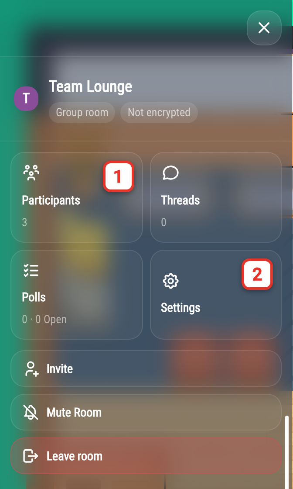
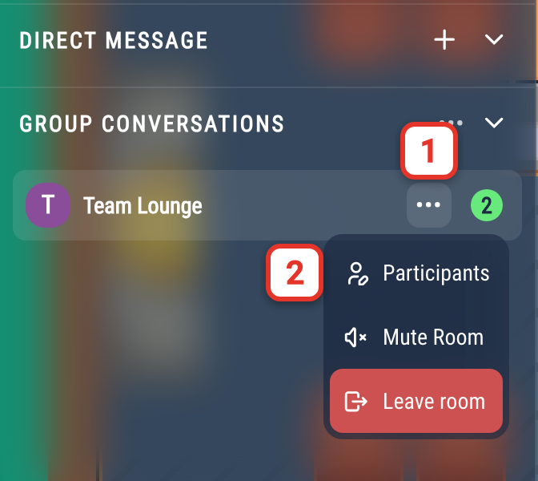
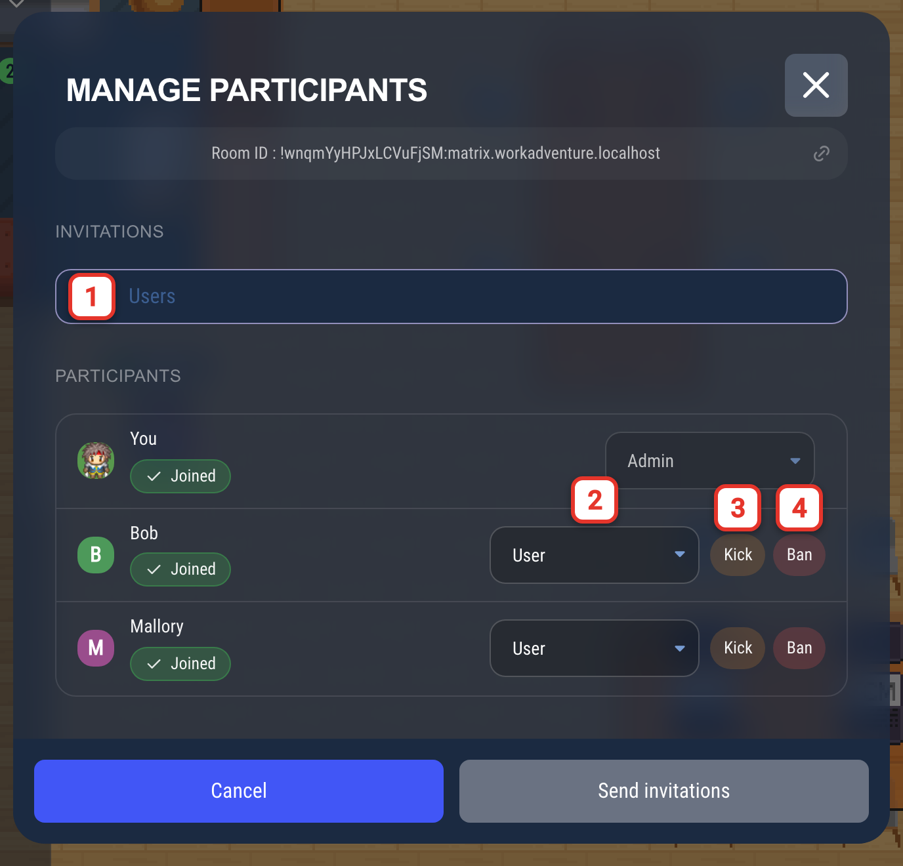
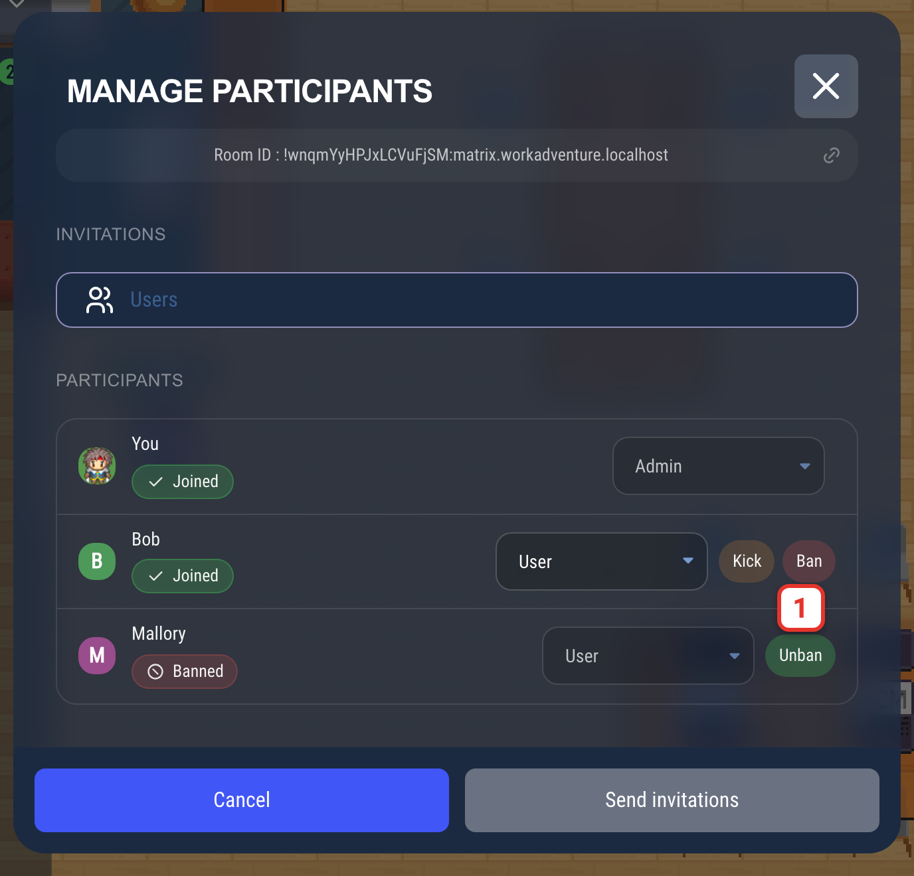
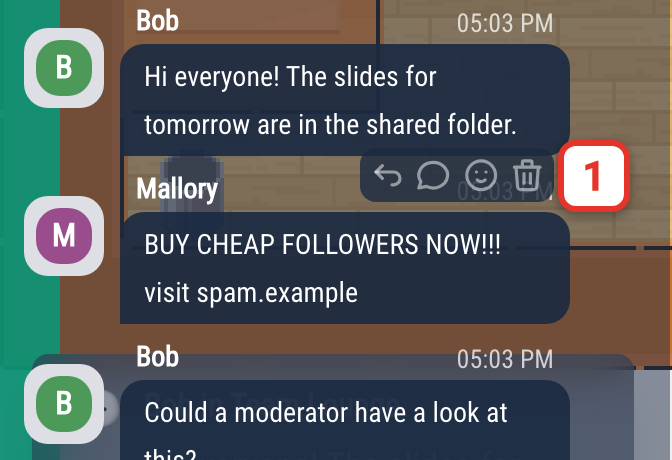
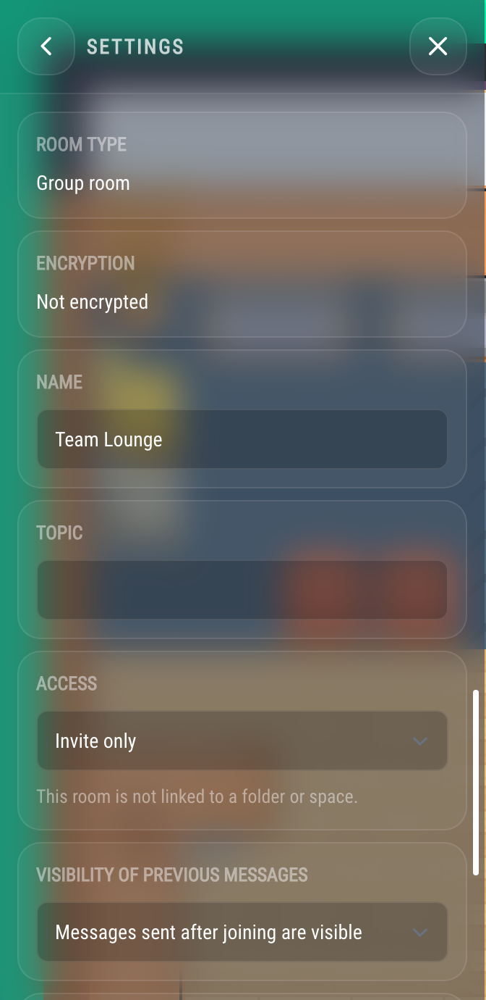
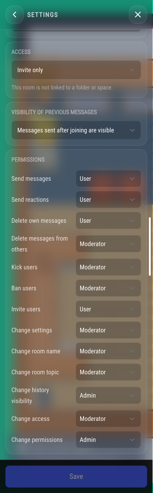

# Moderating chat rooms

This page explains how to moderate a [Matrix chat room](/user/chat#matrix-chat-rooms): roles, removing or banning a
participant, deleting messages and changing what each role is allowed to do.

:::note
This page covers Matrix chat rooms. The Proximity Chat has its own, separate controls (for example to moderate
questions).
:::

## Roles

Every participant of a chat room has one of three roles:

| Role          | Usual rights                                                                                  |
|---------------|-----------------------------------------------------------------------------------------------|
| **Admin**     | Everything, including changing permissions and giving roles.                                  |
| **Moderator** | Invite, kick and ban participants, delete other participants' messages, rename the room.      |
| **User**      | Send messages and reactions, delete their own messages.                                       |

The person who creates a room is its **Admin**.

These are the usual rights. Each room can change them in its [permissions](#permissions).

Roles are **ordered**: you can only act on someone whose role is **lower** than yours. A Moderator can kick a User,
but cannot kick another Moderator or an Admin. An Admin cannot kick or demote another Admin.

:::info Matrix power levels
Roles are a simplified view of Matrix power levels: **User** is 0, **Moderator** is 50 and **Admin** is 100.
:::

## The room panel

Open a chat room, then click the **ⓘ** button at the top right of the conversation (1).

The panel opens. It gives access to **Participants** (1), **Threads**, **Polls** and **Settings** (2).

**Participants** lists the people who joined the room, with their role. This list is read-only. To act on a
participant, use the **Manage participants** window described below.

## Managing participants

In the room list, click the **⋯** button next to the room name (1), then choose **Participants** (2).
You can also click **Invite** in the room panel.

The **Manage participants** window opens. Everyone can open it and see the list of participants with their status:
**Joined**, **Invited**, **Left** or **Banned**. The buttons next to each participant only appear if you are allowed to
use them.

### Inviting people

The **Invitations** field (1) only appears if you are allowed to invite people (**Invite users** in the
[permissions](#permissions)). Type a name or a Matrix ID, then click **Send invitations**.

When a participant has left the room, an **Invite** button appears next to their name to invite them again.

### Kicking someone

Click **Kick** next to a participant (3). They are removed from the room immediately. They can come back later, for
example if someone invites them again.

### Banning someone

Click **Ban** next to a participant (4). They are removed from the room and **cannot come back**, even if someone
invites them, until they are unbanned.

Banned participants stay in the list with the **Banned** status. Click **Unban** (1) to lift the ban. Unbanning does
not bring them back to the room: they can join again under the room's access rules. In an **Invite only** room, they
need a new invitation.

:::caution
Kicking or banning someone from a chat room only applies to that chat room. The person can still enter your world and
use other rooms.

To prevent someone from entering your world, see [Moderation](/admin/moderation) in the admin documentation.
:::

### Changing someone's role

Only Admins can change roles. Pick a new role in the drop-down list next to a participant who has joined the room (2).
You can give a role up to your own: an Admin can make someone else an Admin.

:::caution
An Admin cannot demote another Admin. Make sure you trust someone before you make them an Admin.
:::

## Deleting messages

Hover over a message and click the trash icon (1). The message is replaced with a "Message deleted" notice for
everyone.

- Everyone can delete their own messages, if the room allows **Delete own messages**.
- To delete someone else's message, you need **Delete own messages** and **Delete messages from others**, and a
  higher role than the author.

Polls follow almost the same rules: their author can always delete them. Deleting someone else's poll requires
**Delete messages from others** and a higher role than the author.

## Room settings and permissions

Open the room panel and click **Settings**. If your role does not allow any change, the panel only shows the room
type, encryption, access and visibility of previous messages, without letting you edit them.

The **Settings** section lets you change:

- **Name** and **Topic** of the room.
- **Access**:
  - **Invite only**: people can only join if they are invited.
  - **Restricted**: anyone who is a member of the parent folder can join. This option is only available when the room
    is in a folder.
- **Visibility of previous messages**: **All messages are visible**, **Messages sent after joining are visible** or
  **Messages sent after being invited are visible**.

**Room type** and **Encryption** are shown for information only. Encryption cannot be changed after the room is
created.

### Permissions

The **Permissions** list sets the minimum role (User, Moderator or Admin) needed for each action:

- **Send messages**, **Send reactions**
- **Delete own messages**, **Delete messages from others**
- **Kick users**, **Ban users**, **Invite users**
- **Change room name**, **Change room topic**, **Change history visibility**, **Change access**
- **Change permissions**: who can edit this list. Changing a participant's role also requires the Admin role.
- **Change settings**: every other room setting that is not listed above.

The screenshot shows the starting values of a room created in WorkAdventure. A room created elsewhere (by your
administrator, or in another Matrix client) may start with other values: check this list rather than assuming a
default.

WorkAdventure adds a rule of its own on top of this list: inviting people always needs at least the **Moderator**
role, even when **Invite users** is set to **User**.

For example, to make an announcement room where only moderators can write, set **Send messages** to **Moderator**.

Click **Save** to apply the changes. Only people allowed to **Change permissions** can edit this list.

## Folders

Folders have participants too. Open the folder menu (**⋯**) and choose **Participants**. This option only appears if
you can create rooms in this folder and invite, kick or ban its participants. Removing someone from a folder does not
remove them from the rooms in this folder.

:::info
If you are using the SaaS version of WorkAdventure, administrators can create chat rooms whose members and moderators
are [set automatically from user tags](/admin/chat/matrix-admin-managed-rooms).
:::
