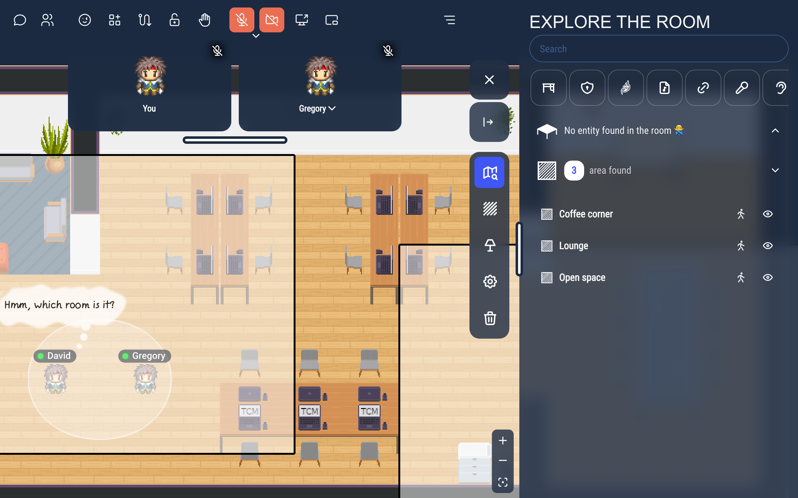
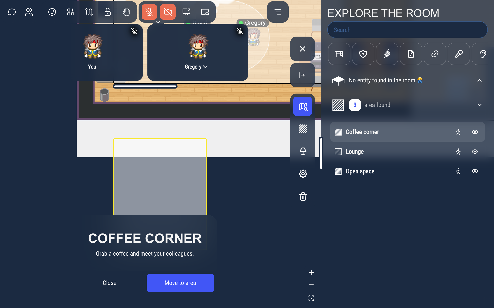
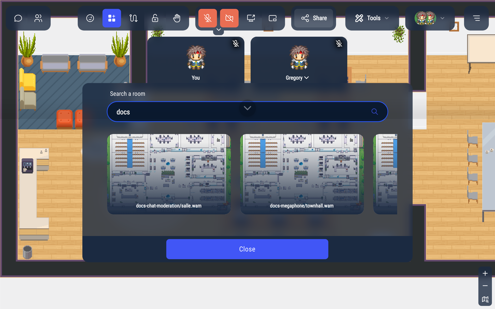

# Finding your way: explorer and room list

## Exploring the room

The explorer lets you look around the map without moving your Woka, and find the places the map creator made searchable.

To open it, click the map icon at the bottom right of the screen (under the zoom buttons). If you have a **Tools** menu in the action bar, **Tools** > **Explore the room** opens it too.

While exploring:

- drag the map, or use the arrow keys, to move the view; use the mouse wheel or the **+** and **−** buttons to zoom,
- the panel on the right lists the objects and areas of the room. Type in **Search** to filter the areas by name (objects are filtered by their type, for example "Desk"), or click the icons to show only the places with a given feature (meeting room, website, sound…),
- hover over a place in the list to see it on the map.

Click a place, or its eye icon, to see its name and description. Click the walking icon, or the main button of the description (**Move to area**, **Move to entity**, or an action such as **Start meeting** or **Open link**: whatever its label, it only walks you there), to walk there: your Woka goes there and the explorer closes.

To come back to your Woka, click the target icon at the bottom right (**Show my location**), or close the panel.

:::info For map creators
Only the areas and objects marked **Searchable in the exploration mode** appear in the explorer. Give them a description in their settings in the map editor (**Add description field**).
:::

## The room list

The room list shows the other rooms (maps) of your world, so you can jump to one of them.

Open it from the apps button of the action bar, then **Room list**.

Type in **Search a room** to filter the rooms by name or description, then click a room to go there. The room you are in is marked **Active**.

A room can be restricted to some tags: it then only shows in the list for people who have one of them.
