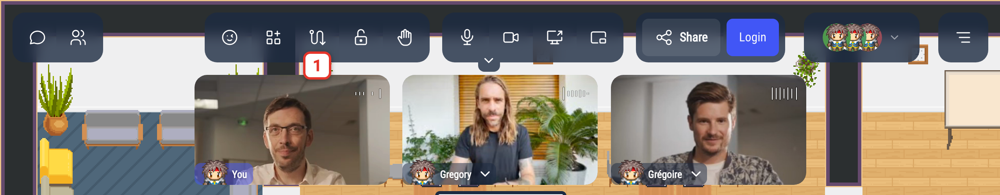
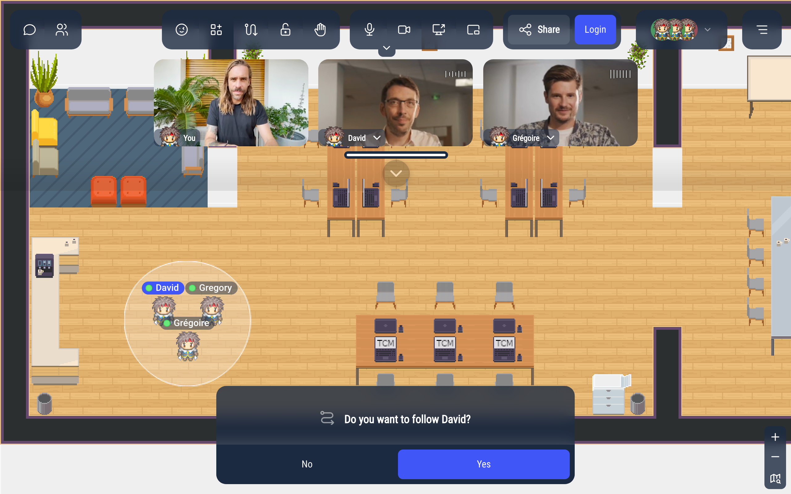
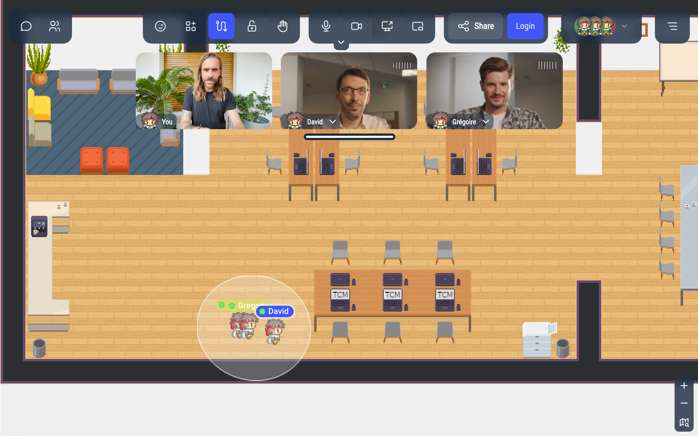
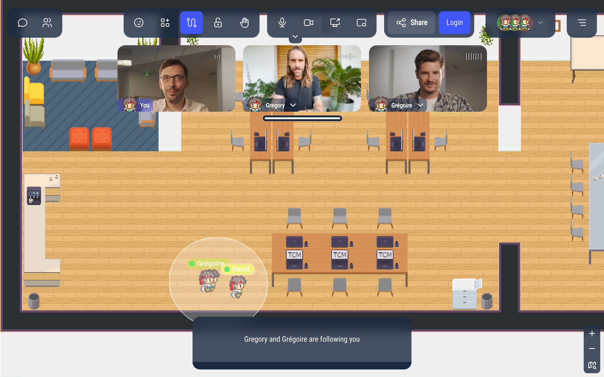

# Leading a group: follow me

Ask the people in your discussion bubble to follow you: their Woka walks behind yours wherever you go. Useful for a visit, an onboarding tour, or to bring a group to a meeting room.

## Asking people to follow you

While you are in a [discussion bubble](/user/proximity-bubble), click the follow button in the action bar (its tooltip says **Ask to follow**), or press **F**.

Everyone else in your bubble receives the request. While you wait for their answer, you see "Waiting for followers confirmation" and a **Stop leading** button to cancel.

The follow button is not available in meeting rooms. On a small screen, it is in the profile menu, under **Contextual actions**.

## Answering a request

When someone asks you to follow them, you see **Do you want to follow David?**:

- **Yes**: your Woka starts walking behind theirs.
- **No** (or **Escape**): you don't follow. On the leader's side, the follow message disappears.

To never receive these requests, turn on **Ignore requests to follow other users** in the [Settings](/user/settings#other-settings).

## While you follow someone

Your Woka follows the leader automatically. The follow button stays highlighted; its tooltip now says **Stop following**.

You can still move a little with the arrow keys, but you are pulled back behind the leader. Nobody in the group can run.

The leader and their followers get an outline of nearly the same color, visible to everyone on the map.

## While you lead

You see who follows you, for example "Gregory and Grégoire are following you".

To stop, click **Stop leading** under that message, click the follow button again (its tooltip now says **Stop leading**), press **F**, or press **Escape**: everybody stops following you.

## When it stops

The group stops following when:

- the leader stops leading,
- a follower clicks the follow button (**Stop following**) or presses **F**,
- a follower loses sight of the leader (for example when blocked behind a wall),
- the leader or the follower leaves the map.

Walking away from the bubble does not stop it.

:::info For map creators
A map script can make the people in a bubble follow someone without asking them first (except those who turned on **Ignore requests to follow other users**). See `WA.player.proximityMeeting.followMe()` in the [Player API](/developer/map-scripting/references/api-player#asking-users-to-follow-you).
:::
