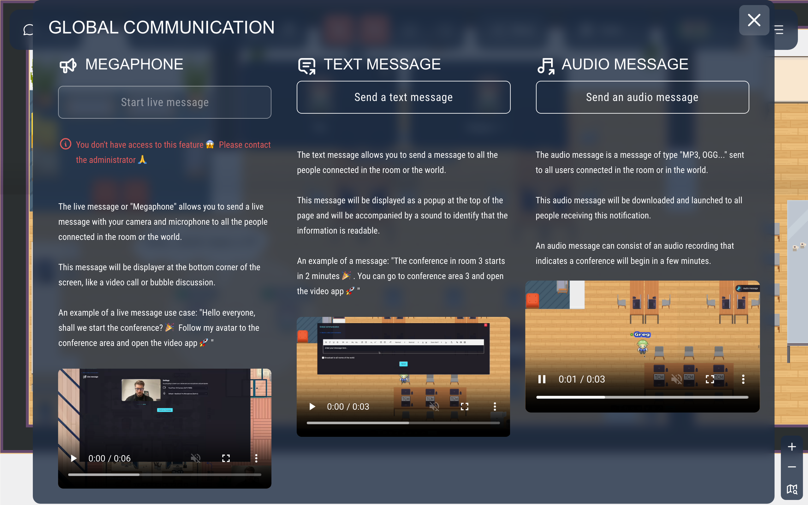
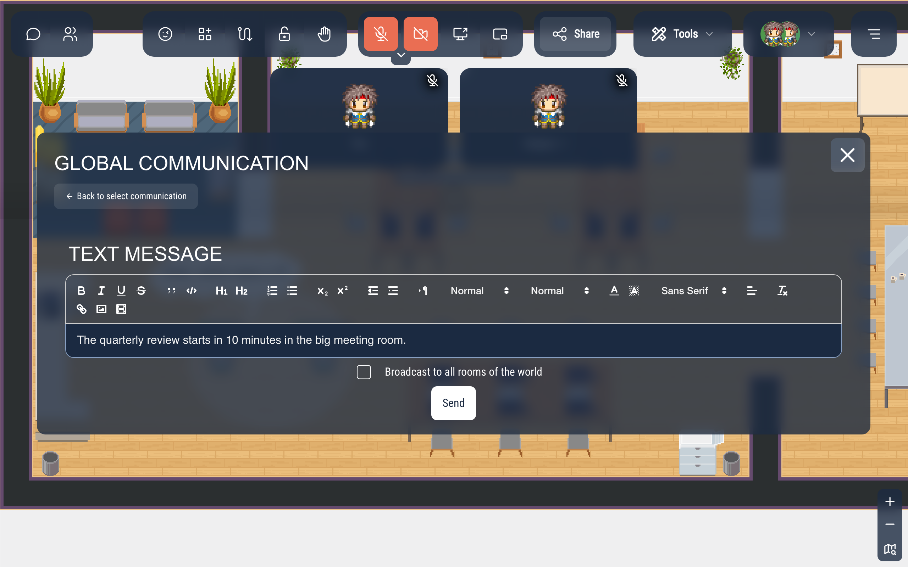

# Sending a message to everyone

Administrators can send a text or audio message to everyone connected to their room, or to the whole world: to announce the start of a conference, a fire drill, the end of the day…

Only users with the `admin` tag can send them. To broadcast your camera and microphone live instead, use the [megaphone](/map-building/inline-editor/megaphone).

## Opening the window

Click **Tools** in the action bar, then **Send global message**. The **Global communication** window offers three choices: **Start live message** (the megaphone, available only if it is enabled for the map and you are allowed to use it), **Send a text message** and **Send an audio message**.

## Sending a text message

1. Click **Send a text message**.
2. Write your message. The toolbar formats the text (bold, lists, colors, links, images…).
3. Tick **Broadcast to all rooms of the world** to send it to every room of your world, not only the one you are in.
4. Click **Send**.

Everyone connected to the room (or to the world) sees the message at the top of the screen, with a short sound. They close it with the cross or **Escape**.

## Sending an audio message

1. Click **Send an audio message**.
2. Click the upload area and choose an audio file (MP3, OGG…). Dragging a file onto the area does not work yet: use the click.
3. Tick **Broadcast to all rooms of the world** if needed, then click **Send**.

The sound plays right away for everyone connected to the room (or to the world). A small **Audio message** panel appears at the top right; its pause button mutes the sound, and the message stops if you don't resume it within 5 seconds.

## Good to know

- Only the people connected at that moment receive the message: it is not kept.
- You also receive your own message.
