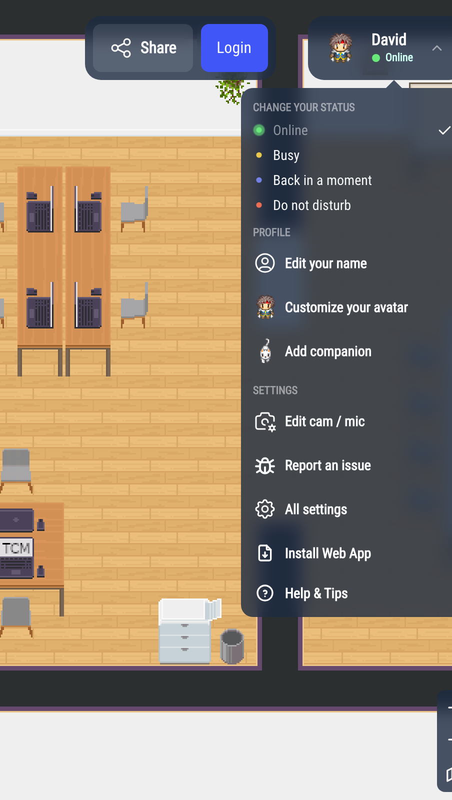
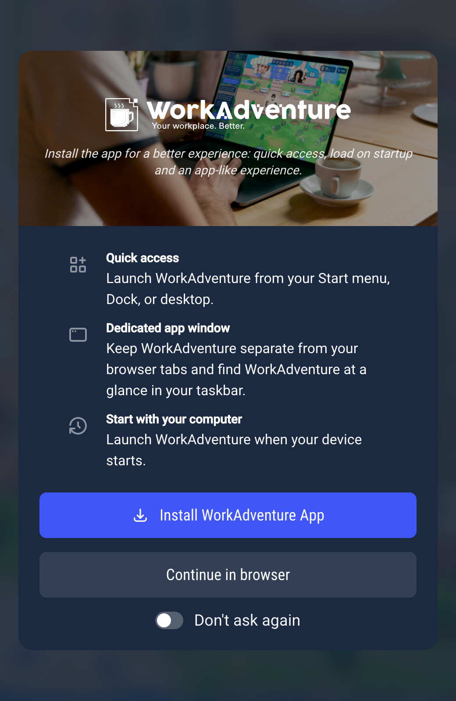
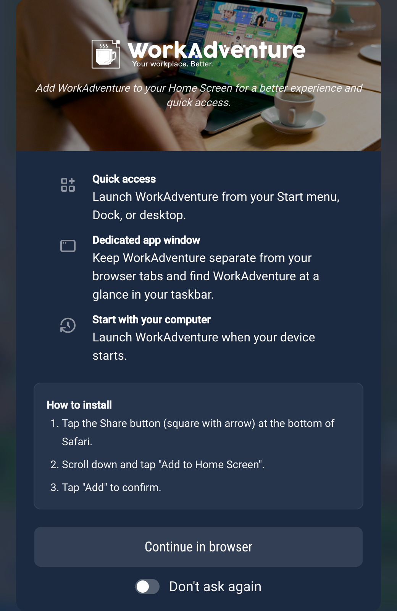

# Installing WorkAdventure as an app

You can install WorkAdventure on your computer or phone, like an app: it gets its own icon and opens in its own window, separate from your browser tabs. It opens directly on the world you installed it from.

## On a computer, with Chrome or Edge

WorkAdventure offers to install itself in two places:

- when you come back to WorkAdventure, a screen offers **Install WorkAdventure App**,
- at any time, in your profile menu (click your name in the top-right corner): **Install Web App**.

Click **Install WorkAdventure App**, then confirm in the window your browser opens.

- **Continue in browser**: you keep using WorkAdventure in your browser. The screen comes back next time.
- **Don't ask again**: the screen and the menu entry no longer appear, in this browser.

The browser decides when an app can be installed, so these entries may only appear after you have used WorkAdventure for a little while. You can also use the install icon in the address bar of your browser.

To have WorkAdventure start with your computer, turn it on in your browser's app settings (in Chrome and Edge, open the installed app's menu, or `chrome://apps` / `edge://apps`). WorkAdventure does not do it by itself.

## On an iPhone or an iPad

The install screen explains how to add WorkAdventure to your Home Screen:

1. Tap the Share button (the square with an arrow) in Safari.
2. Scroll down and tap **Add to Home Screen**.
3. Tap **Add** to confirm.

On an iPad, the Share button is at the top of the screen.

## On other browsers

- **Safari on a Mac**: WorkAdventure does not show the install screen. Use **File** > **Add to Dock** in Safari.
- **Firefox**: Firefox cannot install web apps on a computer.

:::info For administrators
The install screen and the menu entry can be turned off for a whole world: **Bypass PWA** in the world settings of the admin, or `BYPASS_PWA` on a self-hosted server (see [Environment variables](https://github.com/workadventure/workadventure/blob/master/docs/others/self-hosting/env-variables.md)). Browsers can still install the app from their own menu.
:::
