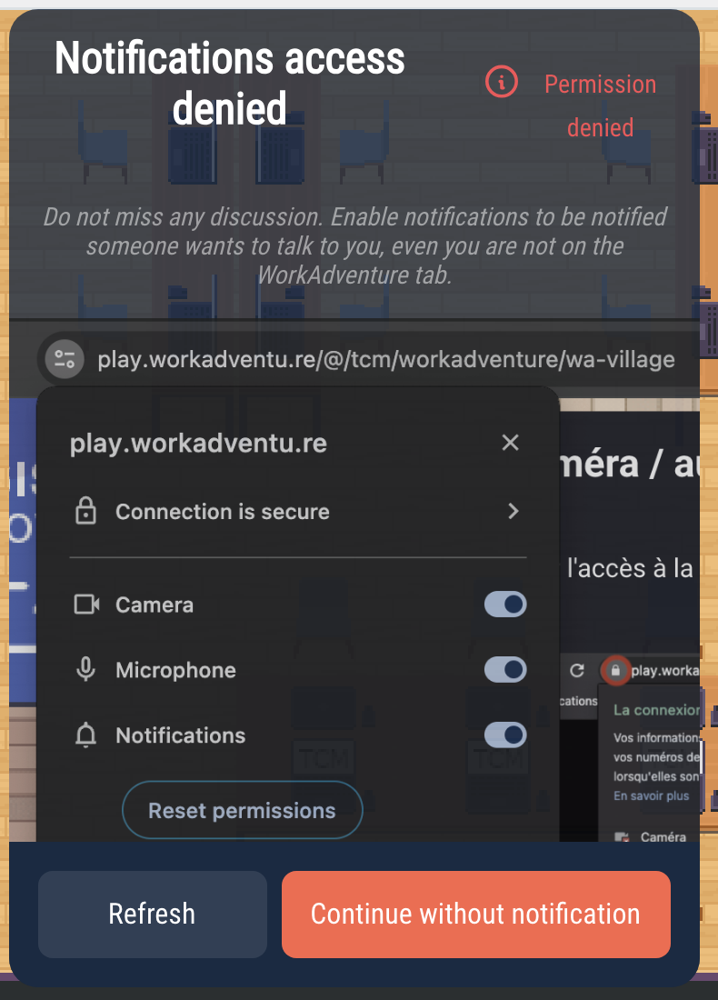
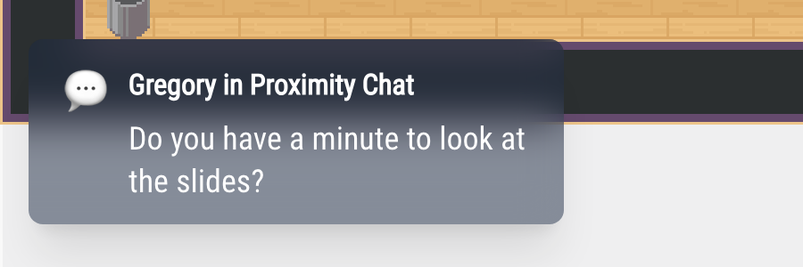

# Notifications

WorkAdventure tells you what is happening in four ways: notifications on your desktop, messages inside WorkAdventure, sounds, and emails. This page explains each of them and how to turn them on or off.

## Desktop notifications

Desktop notifications appear on your computer, outside the browser, when WorkAdventure is not the window you are looking at. They are **off by default**. The administrator of the server can also turn them off for everyone: the **Notifications** switch is then not shown in the Settings.

You get one when:

- **someone wants to talk to you**: someone walked up to you and started a bubble, or joined you in a meeting room where you were alone,
- **a chat message arrives**: click the notification to open the chat on that conversation.

You only get them if all of these are true:

- WorkAdventure is in the background (another tab or another app),
- **Notifications** is on in the [Settings](/user/settings#other-settings) (or you accepted the **Allow notifications?** question, see [Your availability status](/user/availability-status#when-you-are-busy)),
- your browser allows WorkAdventure to show notifications,
- your status is not **Back in a moment** or **Do not disturb**, and you are not in a silent zone, a Jitsi or BigBlueButton room, or on a podium,
- for a chat message, the room is not muted (see [Writing messages](/user/chat-messages#unread-messages-and-sounds)).

### If you refused notifications

If notifications are blocked in your browser and you click **Accept** on **Allow notifications?**, or turn on **Notifications** in the Settings, WorkAdventure shows **Notifications access denied**, with a picture of where to change it (in Chrome):

Once you have refused, WorkAdventure cannot ask again. To allow notifications:

1. Click the icon at the left of the address bar of your browser (a padlock or two sliders).
2. Turn on **Notifications** (or set it to **Allow**, depending on your browser).
3. Reload the page (**Refresh**), then turn on **Notifications** in the Settings.

If notifications are blocked, the **Notifications** switch of the Settings goes back off.

## Messages inside WorkAdventure

Some messages appear inside WorkAdventure, whatever the **Notifications** setting:

- **At the bottom left**, a chat message, a new poll or question, or an invitation to a chat room, when you are not looking at that conversation (in a bubble, the chat opens by itself unless you closed it; muted rooms show nothing). They stay 10 seconds. Click one to open the conversation, or the list of rooms for an invitation.
- **At the top right**, short messages: the name of the area you walk into, "Announcement" when someone starts the megaphone, a moderator muting your microphone, recording messages, and so on. They stay 5 seconds.

## Sounds

| Sound | When | How to turn it off |
|---|---|---|
| Bubble | You, or someone, join or leave your bubble (up to 5 people) | You cannot turn it off; choose **Ding** or **Wobble** in **Bubble sound** in the [Settings](/user/settings#other-settings) |
| Meeting room | You, or someone, join or leave your meeting room (up to 5 people); you receive or send a meeting invitation | Your status |
| New message | A message arrives in a conversation you are not looking at | If you are logged in, **Chat sounds** in the menu, **Chat** tab; or **Mute Room** for one room |
| Megaphone | Someone starts the megaphone | Chosen by the map creator (see [Megaphone](/map-building/inline-editor/megaphone)) |
| Recording | A recording starts or stops (a spoken message) | Chosen by the map creator, in **Configure my room** > **Recording** |

The statuses **Back in a moment** and **Do not disturb** mute all these sounds, except the recording message. So do silent zones, Jitsi and BigBlueButton rooms, and podiums.

## Emails and your phone

- **Emails**: if you are not connected when you receive a chat message, you may receive an email (see [Using the chat](/user/chat#end-to-end-encryption)).
- **On your phone**: use a Matrix app to receive the notifications of the chat rooms (see [Getting messages on your phone](/user/phone-chat)).
