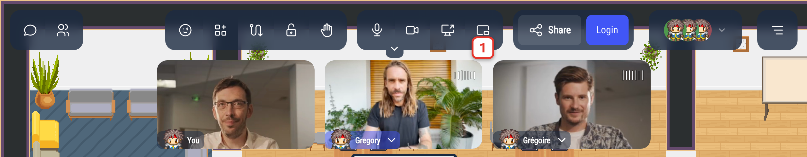
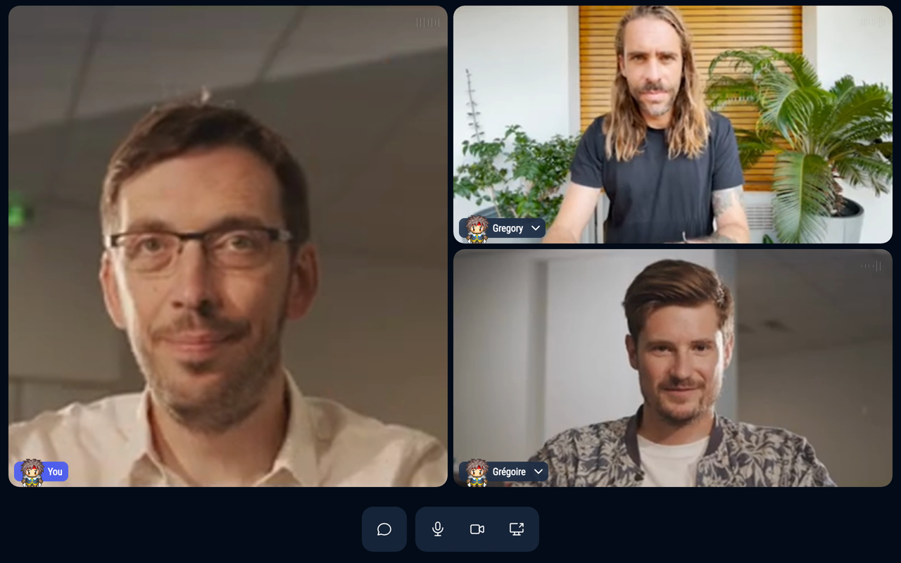

# Picture-in-picture

Picture-in-picture shows the videos of your conversation in a small floating window, above your other windows. You can keep seeing the people you talk to while you work in another tab or another app.

It needs a Chromium-based browser (Chrome, Edge…) on a computer. On other browsers, and on phones, the button does not appear.

## Opening the floating window

During a conversation (a discussion bubble, a meeting room, a podium or the megaphone), click the picture-in-picture button in the action bar (its tooltip says **Picture in picture**). If the window was closed in another way before, you may need to click the button twice to open it again.

The window also opens by itself when you switch to another tab during a conversation, as long as **Enable picture-in-picture** is on in the [Settings](/user/settings#other-settings) (it is on by default). Clicking the picture-in-picture button turns this setting back on.

## The floating window

The window shows the same videos as the top of the WorkAdventure screen. When someone shares their screen, it takes most of the window.
You can resize the window: the videos rearrange themselves.

At the bottom, buttons let you:

- open or close the chat (this brings you back to the WorkAdventure tab),
- turn your microphone on or off,
- turn your camera on or off,
- share your screen.

The sound of the conversation always plays in the WorkAdventure tab, so opening or closing the window never cuts the sound.

## Closing the floating window

The window closes when:

- you go back to the WorkAdventure tab or click in its window,
- the conversation ends,
- you close it, or click the picture-in-picture button again (if you opened the window with the button).
