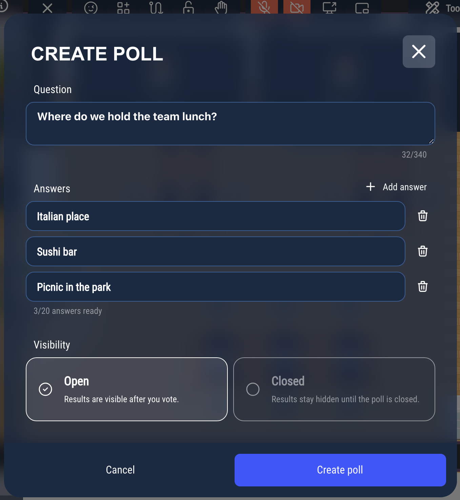
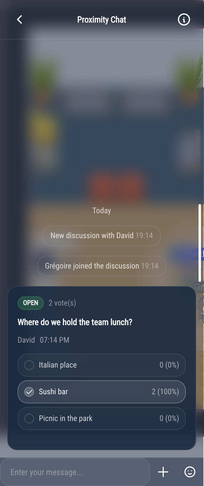
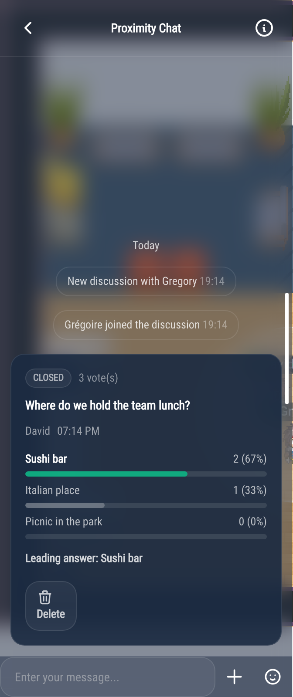
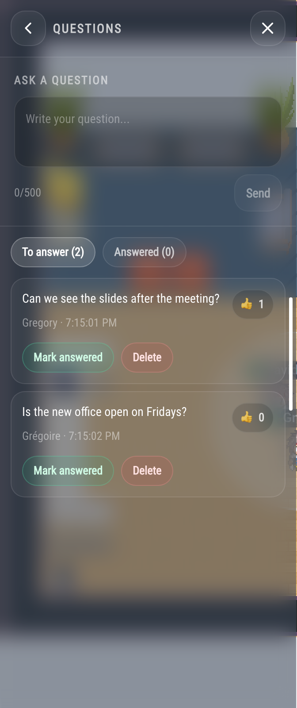

# Polls and questions

In the chat, you can ask everyone a quick question with a **poll**, and collect the audience's questions during a meeting with **Questions**.

## Polls

Polls work in the proximity chat (a bubble, a meeting room or a podium) and in chat rooms.

### Creating a poll

1. In the chat, click **+** next to the message box, then **Poll**.
2. Type your **Question** and at least two **Answers** (up to 20). Click **Add answer** for more, or the trash icon to remove one.
3. Choose the **Visibility**:
   - **Results visible**: each person sees the results as soon as they have voted.
   - **Results hidden**: the results stay hidden until you close the poll.
4. Click **Create poll**.

Each person can choose one answer.

### Voting

Click an answer to vote. Click another answer to change your vote, or the same answer again to take your vote back.

The number of votes is always shown. If the results are visible, you see them after voting:

### Closing a poll

Only the person who created the poll can close it: click **Close poll** at the bottom of the poll. Everyone then sees the results, with the leading answer first. The creator can also **Delete** the poll.

In a chat room, a moderator with a higher role than the creator can also delete a poll (see [Moderating chat rooms](chat-moderation.md)).

### Finding the polls of a room

Click the ⓘ button at the top of the chat, then **Polls**: the list shows the running polls first. You can vote from the list, and **Show** takes you to the poll in the conversation.

:::caution
In the proximity chat, polls are not kept: they disappear when the bubble ends, or when everybody has left the meeting room or the podium. In a chat room, they are kept with the messages.
:::

## Questions

During a meeting, **Questions** collects the questions of the participants, so the speaker can answer the most popular ones first. Questions work in the proximity chat only: a bubble, a meeting room or a podium.

:::note
On a podium, polls and questions only work if the map creator ticked **Associate a dedicated chat channel** (see [Podium and audience](/map-building/inline-editor/area-editor/broadcast)). A meeting room can also have its chat turned off.
:::

### Asking a question

1. In the chat, click **+**, then **Questions** (or the ⓘ button at the top of the chat, then **Questions**).
2. Type your question under **Ask a question**, then click **Send**.

Your name is shown with your question. Each question also appears in the conversation, with the same buttons; **See all questions** opens the Questions panel.

### Voting for a question

Click the thumbs up next to a question to support it, and again to take your vote back. You cannot vote for your own question, nor for a question that has been answered. The questions with the most votes come first.

### Answering

**Mark answered** moves a question to the **Answered** tab. Only administrators and the people speaking on a podium (including someone who was given the floor) can mark a question as answered; in a bubble or a meeting room, only administrators can. It cannot be undone.

The person who asked a question, and administrators, can **Delete** it.

The **To answer** and **Answered** tabs show how many questions are in each.

Like polls, questions are not kept: they disappear when the conversation ends.
