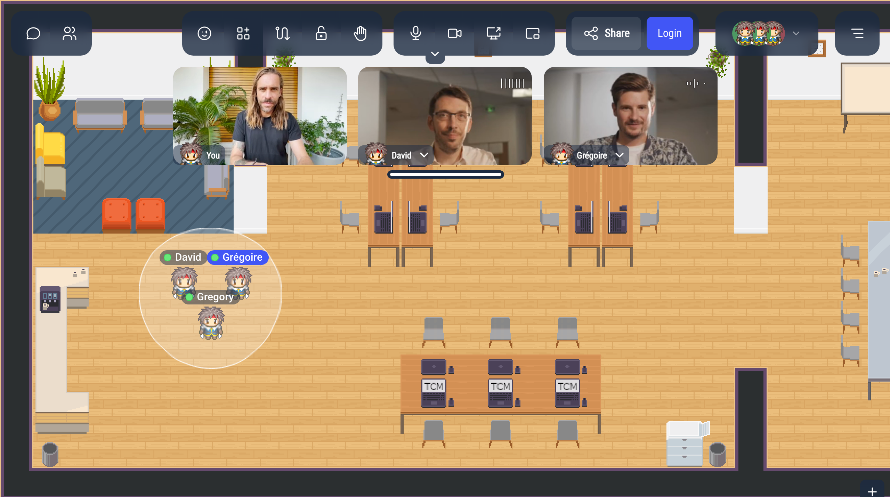
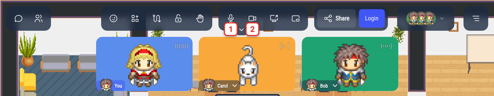
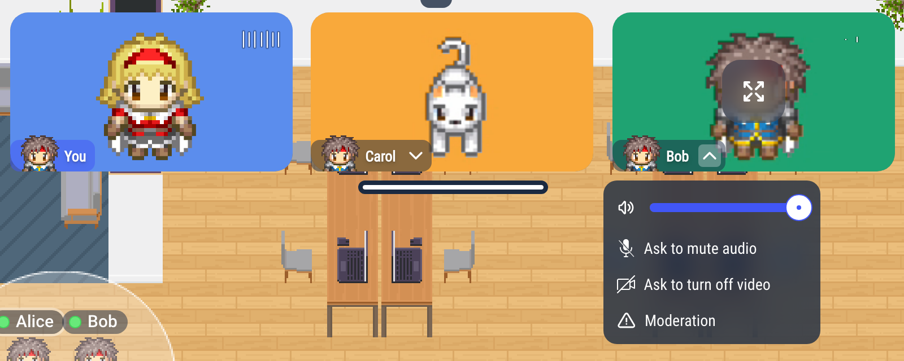
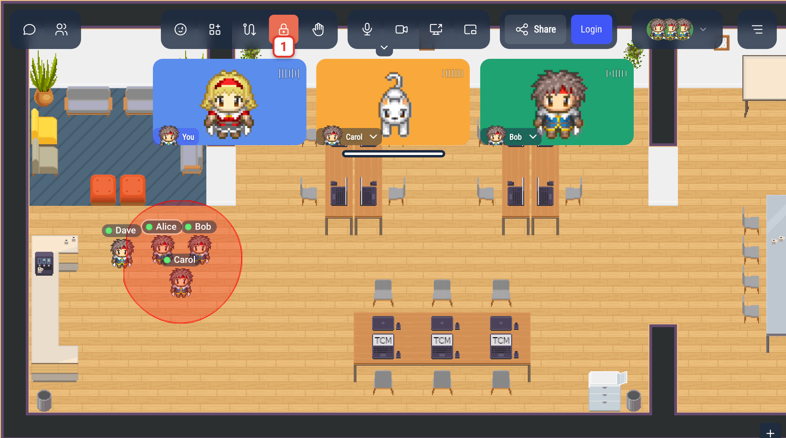

# Talking in a discussion bubble

In WorkAdventure, you talk to people by walking up to them, like in a real office.
When your Woka stops next to someone, a **discussion bubble** opens around you: you can hear each other, see each other's camera, and chat in writing.

## Joining a bubble

Walk up to someone and stop next to them: a bubble opens as soon as you stop. Walking past people does not pull you into their conversation, but if someone stops right next to you while you walk, a bubble can open with them.

- A white circle appears on the map around everyone in the bubble.
- A sound plays when you enter the bubble, and another one when you leave it.
- The video of each person in the bubble appears at the top of your screen. Your own video is labelled **You**.
- The bubble has its own chat: you can write to everyone in it (see [Chat](/user/chat)).

To join a conversation that has already started, walk to the people in the bubble and stop inside the circle.

A bubble holds up to 4 people by default (the administrator of your WorkAdventure can change this number).
When a bubble is full, its circle turns red and nobody else can join it.

## Leaving a bubble

Walk away. When you move far enough from the people in the bubble, you leave it, and their video disappears from your screen.
When only one person is left, the bubble closes.

## Turning your microphone and camera on and off

Use the microphone and camera buttons in the action bar, at the top of the screen:

1. **Microphone**: click to mute or unmute yourself.
2. **Camera**: click to turn your camera on or off.

When a button is red, your microphone or camera is off. When it is greyed out, you cannot turn it on: this happens when your status is **Busy**, **Away**, **Back in a moment** or **Do not disturb**, when you are in a silent zone, or when no microphone or camera is found.

If your browser blocks your camera or microphone, hover over its button: a tooltip titled **Camera access blocked** or **Microphone access blocked** shows how to allow it from the address bar of your browser.

If your microphone is on but WorkAdventure hears nothing from it during a conversation, a message may say "No sound detected from your microphone. There may be a problem; try changing your microphone in settings." Click **Open settings** to choose another microphone (see [Settings](/user/settings)), or **Ignore**.

## Video of the other people

### Enlarging a video

Hover over a video and click the enlarge icon in its middle: the video is shown in large, below the others.
From there, you can show it full screen, or shrink it back.

When someone shares their screen, their screen is enlarged automatically.

### The menu of a person's video

Click the arrow next to a person's name, on their video, to open their menu:

- The slider next to the speaker icon sets the volume of this person, for you only. Click the speaker icon to mute them for you.
- **Ask to mute audio**: ask the person to turn their microphone off. They see "Can I mute your microphone?" and choose **Yes** or **No**.
- **Ask to turn off video**: ask the person to turn their camera off, the same way.
- **Moderation**: block the person (you stop seeing and hearing them, only for you, and you can unblock them later) or report them to the administrators.

The first two requests are greyed out when the person's microphone or camera is already off.
Administrators see **Mute audio** and **Turn off video** instead, which turn them off without asking, plus **Mute audio for everybody**, **Turn off video for everybody** and **Kick off user**.

If the person has a business card, the menu also shows **Visit card**.

## Locking the bubble

To keep a conversation between the people already in it, lock the bubble: people who come near it cannot join.

1. While you are in a bubble, click the lock button in the action bar.

When the bubble is locked:

- the lock button is red,
- the circle of the bubble turns red on everyone's map,
- people who walk up to the bubble stay outside. They are not told why.

Anyone in the bubble can lock or unlock it. Click the lock button again to unlock it.
The bubble stays locked while people come and go inside it. When the bubble closes, the lock is gone: the next bubble starts unlocked.

If you are also inside a lockable area of the map, the lock button shows the lock of the area, and clicking it opens **Choose area to lock/unlock**: pick **Discussion bubble** to lock the bubble, or the area to lock the area (see [Lockable area](/map-building/inline-editor/area-editor/lockable-area)).

## When you cannot join a bubble

Nobody can start or join a bubble with you when:

- your status is **Do not disturb** or **Back in a moment**,
- you are in a **silent zone** of the map (see [Silent property](/map-building/inline-editor/area-editor/silent)),
- you are in a meeting room, a Jitsi or BigBlueButton room, on a podium or in its audience: the meeting replaces the bubble (see [Meeting room property](/map-building/inline-editor/area-editor/meetingRoom)).

When your status is **Busy**, a bubble can still form around you, but your microphone and camera stay off. When someone joins you, a message asks whether you want to talk with them: click **Accept** to go back **Online**.

## Raising your hand

In a bubble, you can raise your hand to signal that you want to speak, without interrupting whoever is talking (see [Raising your hand](/user/raise-hand)).

## Settings

In the **Settings** menu:

- **Bubble sound** chooses the sound played when you enter or leave a bubble.
- **Proximity discussion volume** sets the default volume of the people you talk to.

To choose your microphone, camera and speakers, blur your background or reduce noise, see [Settings](/user/settings).
