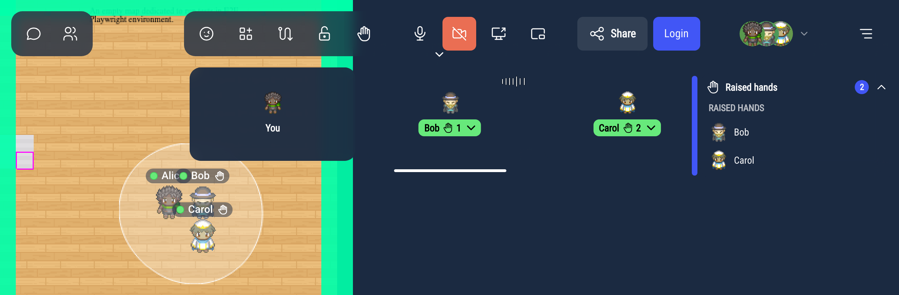
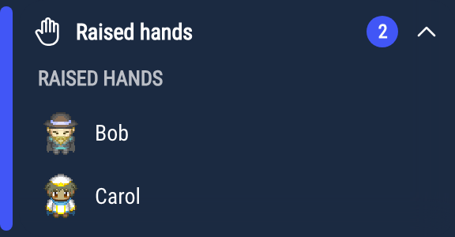
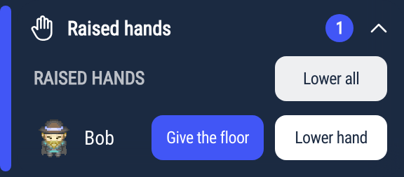

# Raising your hand

Raise your hand to signal that you want to speak, without interrupting whoever is talking.
Your raised hand is shown on the map and on your video tile.

## Raising your hand

The **Raise your hand** button sits in the action bar, next to the camera and microphone buttons.
On small screens, it is in the profile menu.

Click it to raise your hand, and click it again to lower it. The button has three states:

- **Normal**: your hand is down. Click to raise it.
- **Highlighted**: your hand is up. Click to lower it.
- **Green** (**Give back the floor**): you were given the floor (see [Giving the floor](#giving-the-floor)). Click to give it back.

You can raise your hand:

- in a discussion bubble, when you are talking with other people around you,
- in a meeting room,
- in the audience of a podium,
- while someone is broadcasting through the megaphone, if you are in no other conversation.

The button is hidden while you are broadcasting from a podium or through the megaphone yourself, in a silent zone, and while a Jitsi or BigBlueButton meeting is open (Jitsi has its own "raise hand" button).
If someone gives you the floor, the button stays visible, in green.

Map creators can also turn raising hands off in a meeting room or in an audience zone (see [Meeting room property](/map-building/inline-editor/area-editor/meetingRoom) and [Podium and audience](/map-building/inline-editor/area-editor/broadcast)).

### Choosing where to raise your hand

You raise and lower your hand separately in each conversation, and your hand can be up in more than one at a time.
## What others see

When you raise your hand, the people in that conversation see:

- a hand next to your name, above your Woka on the map,
- your name on a green background on your video tile, with a hand badge. When several people have raised their hand, the badge also shows your position in the queue.

In a discussion bubble or a meeting room, a **Raised hands** panel also opens in the top-right corner of everyone's screen. It lists the people with a raised hand, in the order they raised it, so whoever leads the discussion knows who is next.
On a podium or in the megaphone, only the person broadcasting and the administrators see this panel (see [For speakers and moderators](#for-speakers-and-moderators)).

If you are in several conversations, the panel has one section per conversation, headed with its name.

The panel appears while at least one hand is raised or someone holds the floor. Click its title to fold or unfold it.

## Lowering your hand

Click the **Raise your hand** button again to lower your hand. If a list of conversations opens, click the highlighted conversation where you want to lower it.

Your hand is also lowered automatically when:

- you leave the conversation (you walk away from the bubble, you leave the meeting room or the audience),
- you are given the floor,
- you leave WorkAdventure.

Turning your microphone on or speaking does not lower your hand.

## For speakers and moderators

Administrators (users with the `admin` tag) can lower someone else's hand, in any conversation. In the **Raised hands** panel, they see:

- **Lower hand** next to each person,
- **Lower all** next to the "Raised hands" heading.

The person is told "A moderator lowered your hand".

### Giving the floor

When you are broadcasting from a podium or through the megaphone, the people in your audience who raised their hand appear in your **Raised hands** panel, with the same **Lower hand** and **Lower all** buttons.

Click **Give the floor** next to someone to let them speak to the whole audience. You can also find **Give the floor** in the "More actions" menu of their video.

- Their hand is lowered, and their microphone and camera, if they are on, are broadcast to the audience right away, without asking them first.
- If their microphone is off, it stays off: they are told "It's your turn to speak — enable your microphone". Otherwise, they are told "It's your turn to speak".
- They appear in the **Speaking** section of the panel.
- Click **Take back the floor** to stop them. They can also click their green button to give the floor back.

Being given the floor does not give moderation rights: the person cannot lower other people's hands or give the floor to someone else.

Giving the floor only exists on podiums and in the megaphone. In a discussion bubble or a meeting room, everyone can already speak.
