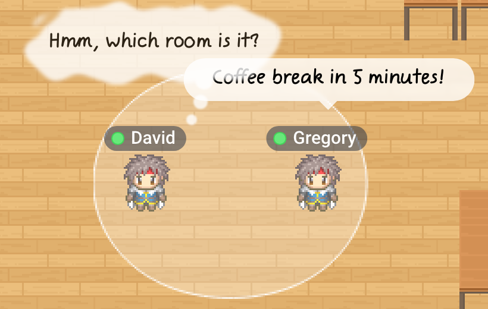
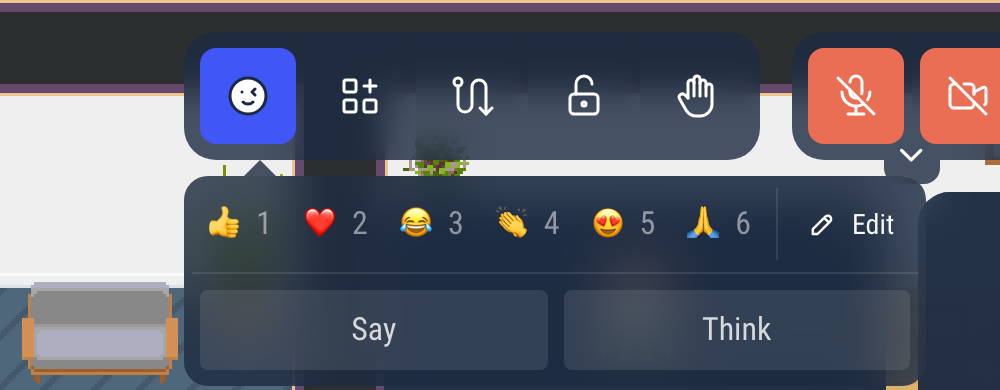
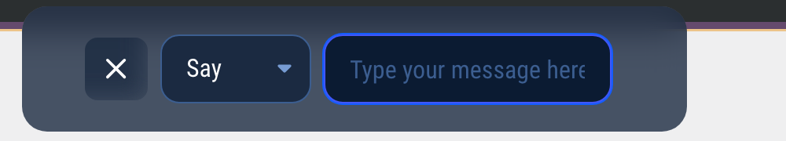

# Say and think bubbles

Make a comic-style bubble appear above your Woka, to say something to the people around you without using the chat.

## Writing a bubble

- Press **Enter** to open a **Say** bubble, or **Ctrl + Enter** to open a **Think** bubble.
- Or click the emoji button in the action bar, then **Say** or **Think**.

Type your text (up to 100 characters), then press **Enter**. You can switch between **Say** and **Think** in the list next to the text. **Escape** closes the window without sending.

## Say or think

- **Say**: the bubble stays 5 seconds.
- **Think**: the cloud stays until you move.

A new bubble replaces the previous one. Everyone who can see your Woka sees it.

Your status can override the shortcut: the window opens on **Think** when you are **Busy**, **Back in a moment** or **Do not disturb** (see [Your availability status](/user/availability-status)), and on **Say** in a meeting or on a podium. You can still change it in the list.

:::info For administrators
The bubbles can be turned off for a whole world: **Enable comics-like bubbles**, in the **Chat & User List** section of the world settings in the admin (premium worlds).
:::
