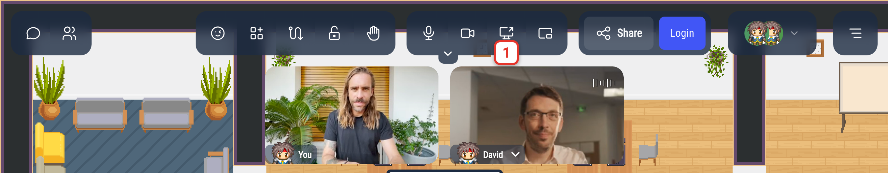
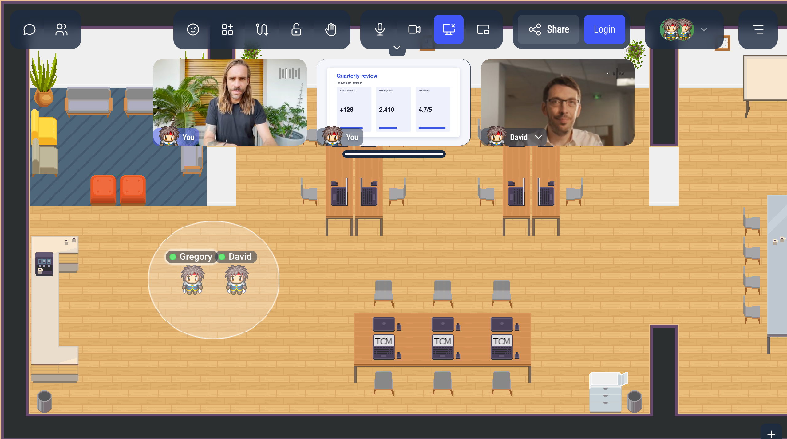
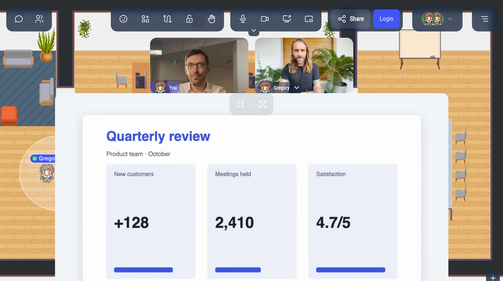

# Sharing your screen

Share your screen, a window or a browser tab with the people you are talking to: slides, a document, some code, a design…

## Starting a screen share

The screen sharing button appears in the action bar as soon as you are in a conversation: a [discussion bubble](/user/proximity-bubble), a meeting room, or on a podium or in the megaphone when you are the one speaking. In a discussion bubble, it only appears once someone joins you. In a meeting room, it appears as soon as you enter, even if you are alone.

1. Click the screen sharing button (**Share your screen**).
2. Your browser asks what to share: your entire screen, a window, or (in Chrome and Edge) a browser tab. Choose, then click **Share** (**Allow** in Firefox).

To share the sound of a video along with the image, use Chrome or Edge: share a **browser tab** and tick the option to share the tab audio. Firefox and Safari do not share sound.

While you share, the button is highlighted, and your share appears as a second video labelled **You**, next to your camera.

If you close the browser's window without choosing, nothing is shared: click the button again to choose. If your screen cannot be shared, the message "Cannot start screen sharing" appears.

## What the others see

The people in the conversation see your screen in a large view, below the videos.

Hover over the shared screen to show two buttons:

- the shrink button puts the shared screen back among the other videos,
- the enlarge button makes it fill the whole window, with the other participants' videos in a side panel (the arrow on the edge hides it). To come back, click the shrink button or **Exit fullscreen** in the side panel.

Several people can share their screen at the same time: the most recent share is shown in the large view, and the others stay among the videos. Click the enlarge icon of a video to show it in the large view instead.

## Stopping a screen share

Click the screen sharing button again, or **Stop sharing** in the bar your browser shows.

Your share also stops when you leave the conversation: when you walk out of the bubble, leave the meeting room or step off the podium.

## Image quality

To change the quality of your screen share, open the [Settings](/user/settings#video-quality-and-screen-sharing-quality) menu:

- **Screen sharing quality**: **Low** (up to 1280×720), **Recommended** (up to 1920×1080, the default) or **High** (up to 2560×1440).
- **If network bandwidth is limited**: **Keep text readable** (the default, best for slides and code), **Keep smooth animations** (best for videos) or **Keep framerate and resolution balanced**.

The maximum resolution is set when you start sharing: after a change, stop and start your share again.

## When you cannot share your screen

- **On a phone or a tablet**: most mobile browsers cannot share the screen, so the button does not appear.
- **In a Jitsi or BigBlueButton room**: use the screen sharing of Jitsi or BigBlueButton instead. Opening one of them stops your WorkAdventure share.
- **The map turned it off**: the map's script can disable screen sharing. The button is then greyed out.
- **In the audience of a megaphone or a podium**: only the speaker can share their screen. The button does not appear, even when the speaker can see the audience.
