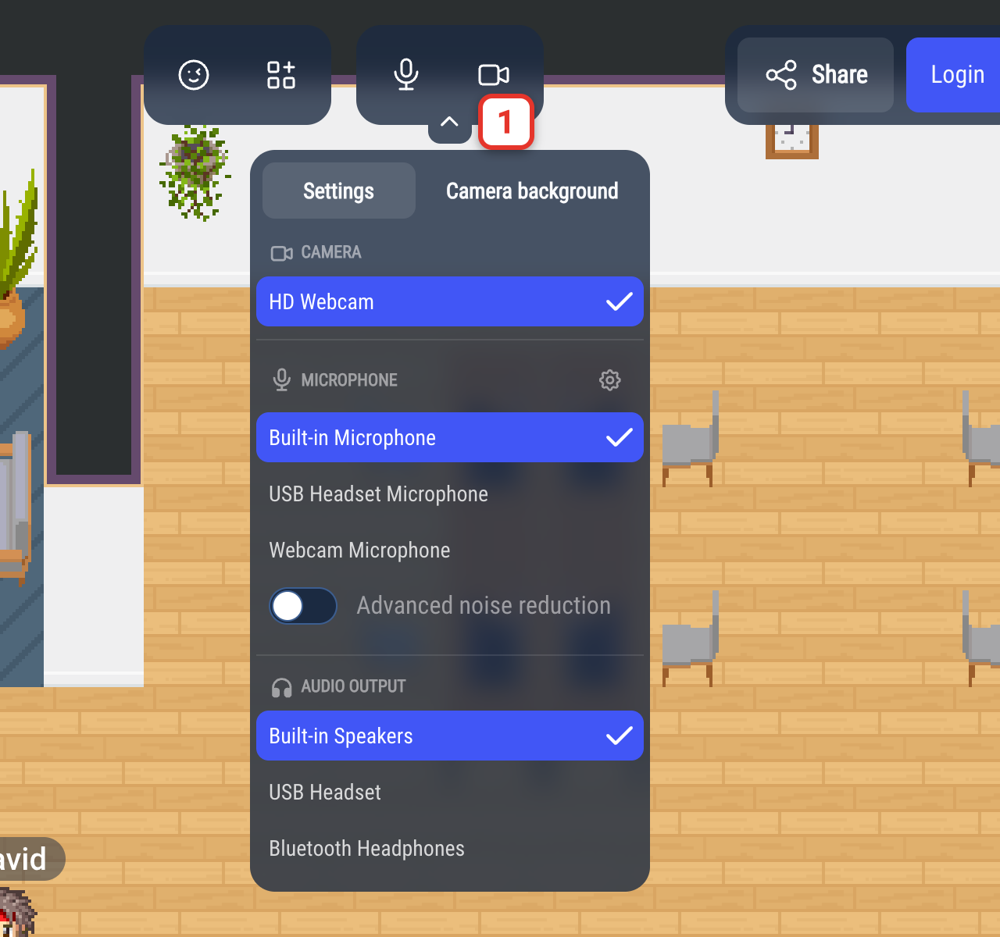
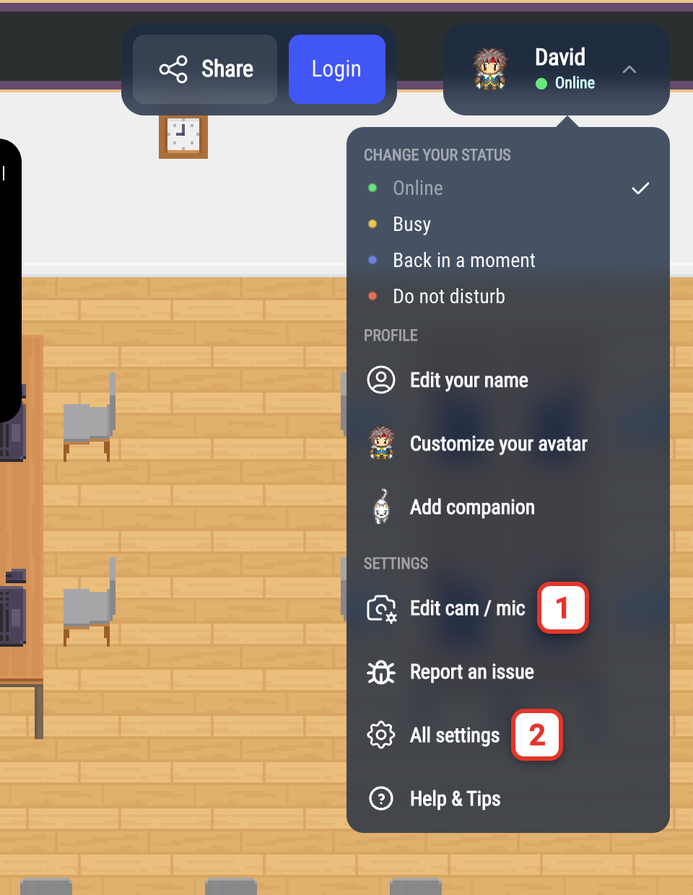
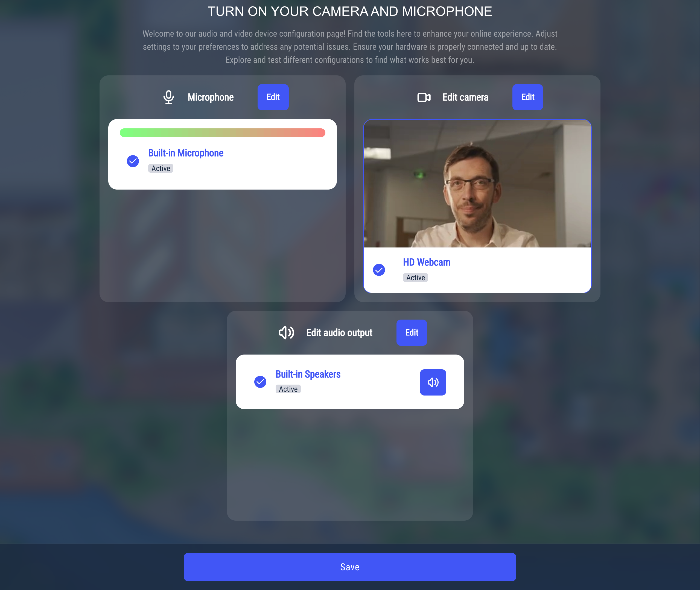
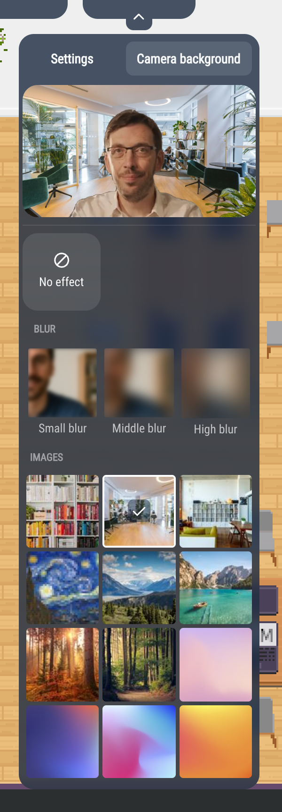
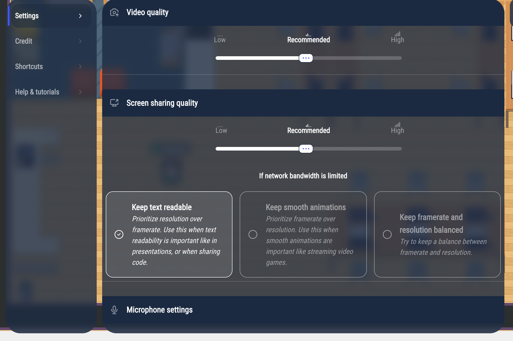
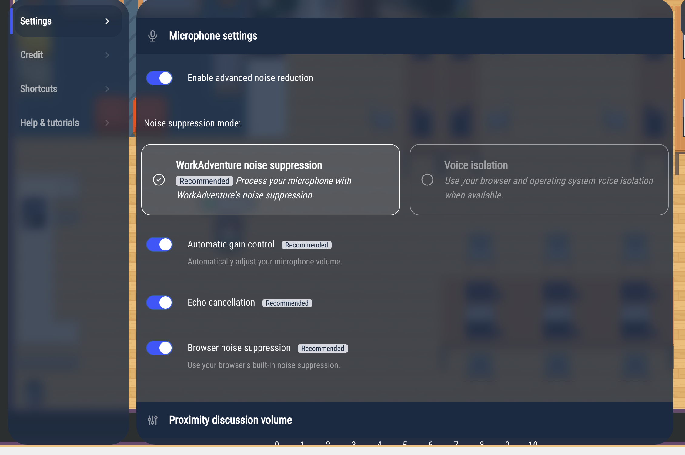
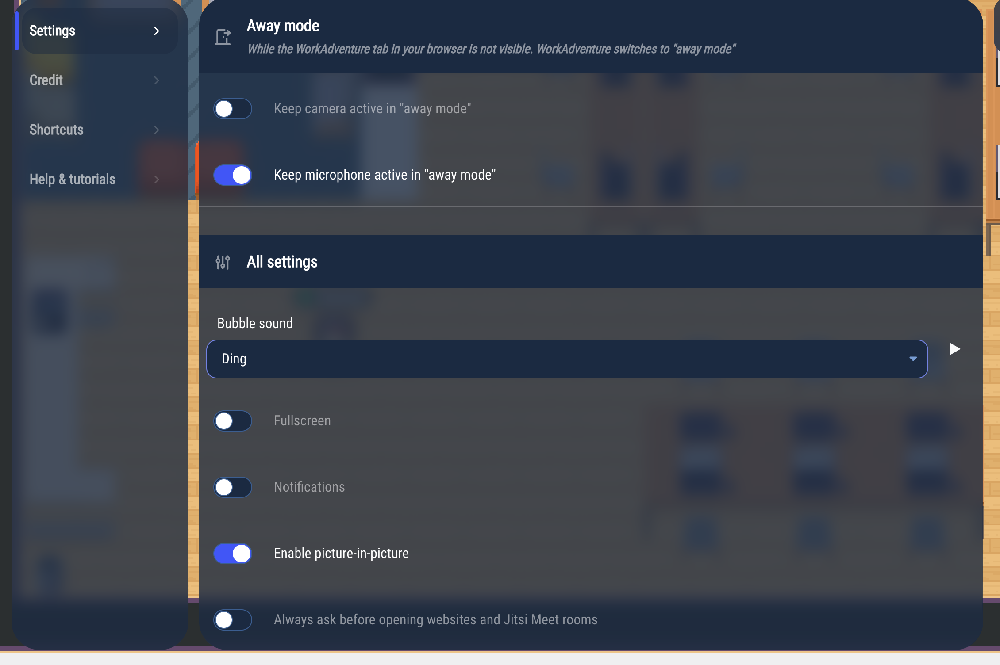

# Settings

You can adjust WorkAdventure in two places:

- the **device panel**, under the microphone and camera buttons, to pick your camera, microphone and speakers, and to blur or replace your background,
- the **Settings** menu, for everything else: video quality, microphone processing, language, away mode, sounds, notifications…

## Choosing your camera, microphone and speakers

Hover over the microphone and camera buttons in the action bar, then click the small arrow under them (1). During a conversation, the arrow is always visible.

The **Settings** tab of the panel lists your devices in three sections:

- **Camera**
- **Microphone**
- **Audio output**: where you hear the other people.

Click a device to switch to it right away. WorkAdventure remembers your choice for the next time.

Some browsers, like Safari, do not let websites choose the audio output: the **Audio output** section is then empty, and the sound plays on the default output of your computer. On other browsers, if no output can be listed, the section says **No speaker device found**.

If a section shows **Camera access blocked** or **Microphone access blocked**, your browser denies WorkAdventure access to the device: click **Open settings** to see how to allow it in your browser.

Under the microphones, the **Advanced noise reduction** switch turns on WorkAdventure's noise reduction (see [Microphone settings](#microphone-settings)).
The gear next to **Microphone** opens the microphone settings of the Settings menu.

When WorkAdventure hears nothing from your microphone, the message "No sound detected from your microphone" offers an **Open settings** button: it opens this panel.

### The camera and microphone setup screen

The screen **Turn on your camera and microphone** opens the first time you enter WorkAdventure (unless your administrator turned it off). You can open it again at any time: click your name in the top-right corner, then **Edit cam / mic** (1).

It shows a card per device: **Microphone** with a sound level meter, **Edit camera** with a preview of your camera and, except on Safari, **Edit audio output**. Click **Edit** on a card to choose another device. In the audio output card, the speaker button plays a test sound. Click **Save** to go back to the map.

## Blurring or replacing your background

Open the device panel and click the **Camera background** tab.

The preview at the top shows the result. Choose:

- **No effect** (the default),
- **Small blur**, **Middle blur** or **High blur**,
- one of the images.

Your choice is saved, and applied whenever your camera is on.

Background effects need a computer with at least 4 processor cores and a recent browser with graphics acceleration. Otherwise, the tab says "Background effects are not supported on this browser". If the effect fails while your camera is on, the message "Failed to apply background effects" appears and your camera goes back to **No effect**.

## The Settings menu

Click your name in the top-right corner, then **All settings** (2 on the image above).

The menu opens on its **Settings** tab. The **Credit**, **Shortcuts** and **Help & tutorials** tabs are always there; other tabs, like **Chat** or **Contact**, depend on your WorkAdventure.

### Video quality and screen sharing quality

- **Video quality** sets the quality of camera videos: **Low**, **Recommended** (the default) or **High**. Choose **Low** if your connection is slow: your video is sent in lower quality and, in large meetings, you also receive the others' videos in lower quality.
- **Screen sharing quality** does the same for your screen sharing.

Under **If network bandwidth is limited**, choose what your screen sharing keeps when the connection gets slow:

- **Keep text readable** (the default): the image stays sharp, but may move less smoothly. Best for slides, documents and code.
- **Keep smooth animations**: the image moves smoothly, but may get blurry. Best for videos and games.
- **Keep framerate and resolution balanced**: a bit of both.

This choice only applies to screen sharing, not to your camera.

### Microphone settings

- **Enable advanced noise reduction** (off by default) removes background noise (keyboard, fan, street…) from your microphone. When it is on, choose the **Noise suppression mode**:
  - **WorkAdventure noise suppression** (recommended): the noise is removed by WorkAdventure, in your browser.
  - **Voice isolation**: the noise is removed by your browser and your operating system. This choice only appears when they support it.
- **Automatic gain control** (on by default) automatically adjusts the volume of your microphone.
- **Echo cancellation** (on by default) prevents the others from hearing themselves through your speakers.
- **Browser noise suppression** (on by default) uses the simpler noise reduction built into your browser. It is not used while WorkAdventure noise suppression is running. This switch only appears when your browser supports it.

Keep the switches marked **Recommended** on, unless you have a good reason to turn them off (for example, echo cancellation with a professional audio interface).

### Proximity discussion volume

Sets the default volume of the people you talk to, from 0 to 10 (10 by default). You can also change the volume of one person from the menu of their video (see [Talking in a discussion bubble](/user/proximity-bubble#the-menu-of-a-persons-video)).

### Language

Choose the language of WorkAdventure. By default, it follows the language of your browser. If you log in with an account, the language of your account may replace this choice when you enter.

### Away mode

When you switch to another window or another tab, WorkAdventure goes into **away mode**, unless you are in a video conversation or broadcasting:

- **Keep camera active in "away mode"** (off by default): when it is off, your camera turns off while you are away.
- **Keep microphone active in "away mode"** (on by default): when it is off, your microphone turns off while you are away.

The administrator of your WorkAdventure can change these defaults.

### Other settings

The last section groups these settings:

- **Bubble sound**: the sound played when you, or someone else, join or leave your discussion bubble: **Ding** (the default) or **Wobble**. Click ▶ to listen to it.
- **Fullscreen**: shows WorkAdventure in full screen.
- **Notifications**: shows desktop notifications. Your browser asks for your permission; if you refuse, the switch turns back off.
- **Enable picture-in-picture** (on by default): when you leave the WorkAdventure tab during a conversation, the videos open in a small floating window. This needs a browser that supports it, like Chrome or Edge.
- **Always ask before opening websites and Jitsi Meet rooms**: when a website or a Jitsi room of the map would open by itself, WorkAdventure asks you first.
- **Ignore requests to follow other users**: you no longer receive requests to follow someone.
- **Decrease audio player volume while speaking** (on by default): while you are in a conversation, the music and sounds of the map play at half volume.
- **Block ambient sounds and music**: stops the music and sounds played by the map.
- **Disable map animations**: stops the animated tiles of the map.
- **Display video quality statistics**: shows technical information (resolution, codec…) on the videos.

## Where your settings are saved

Your settings are saved in your browser, on this computer. If you use another browser or another computer, you start again with the default settings.
