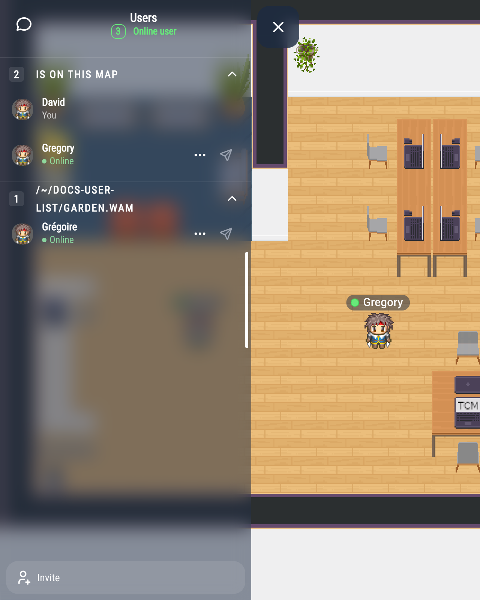
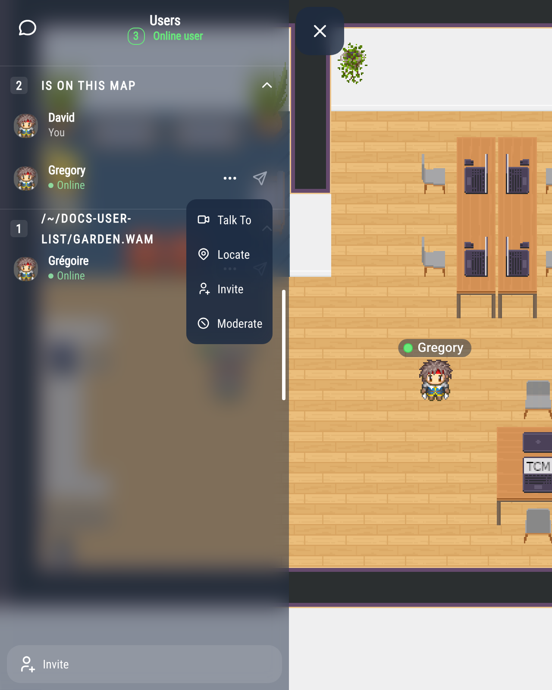
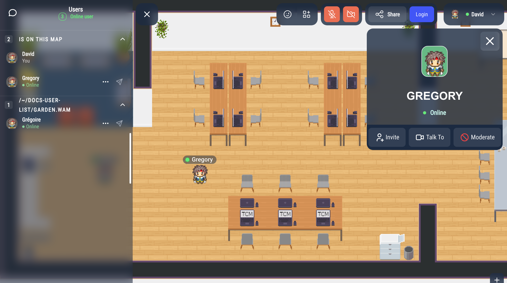
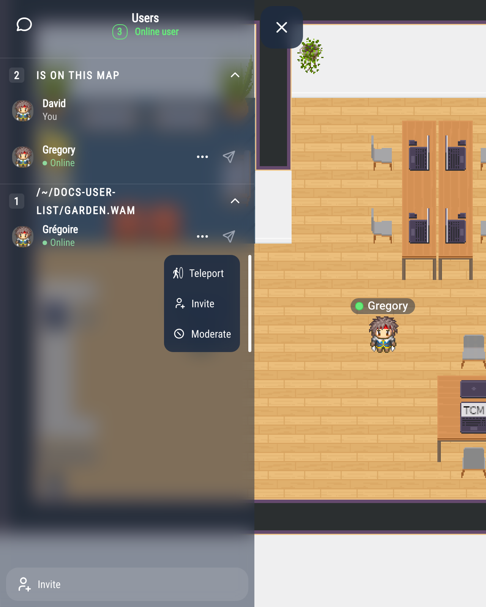

# Finding people: the user list

The user list shows everyone in your WorkAdventure world, on this map or another one. From it, you can walk up to someone, find them on the map, join them on their map, or send them a message.

## Opening the user list

Click the people icon in the action bar, at the top-left of the screen, or press **U**. On a small screen, this icon is not in the action bar: open the chat, then click the people icon at the top-left of the chat panel. The list opens in the chat panel, under the title **Users**, with the number of people online.

People are grouped by map:

- **Is on this map**: the people on your map, you first. This section is open.
- one section per other map, named after the map (or its address). These sections start folded: click a section title to open or fold it.
- **Not connected to the world**: the members who are not connected right now, and the people you have a direct conversation with in the chat. This section only appears if your administrator turned it on.

Each line shows the person's name, their [status](/user/availability-status), and **Admin** for administrators.

To find someone, open the search with the magnifying glass in the header (on a small screen, it is in the header menu, under **Search**) and type part of their name.

Click the name of someone on your map to open their card, as with **Locate** below. The card offers **Talk To**, **Invite**, **Moderate** and, when you can chat with them, **Send Message**. Clicking the name of someone on another map does nothing.

## Actions on a person

Click **…** next to a person to see what you can do. The actions depend on where the person is. People in **Not connected to the world** have no **…** button.

### Someone on your map

- **Talk To**: your Woka walks up to the person, and a [discussion bubble](/user/proximity-bubble) opens when you arrive.
- **Locate**: the view moves to the person and follows them, and their card opens. Close the card, or move, to come back to your Woka. If the person cannot be found after a few seconds, a message says so.
- **Invite**: invites the person to join your conversation (see [Meeting invitations](/user/chat#meeting-invitations)).
- **Moderate**: block or report the person. Administrators can also kick or ban them.

### Someone on another map

- **Teleport**: takes you to the person's map, then your Woka walks up to them.
- **Moderate** and **Invite**, as above. If they accept your invitation, they are taken to your map and walk to you.

If the person has a business card, **Business Card** opens it.

## Sending a message

The paper plane icon next to a person opens a direct conversation with them in the chat. It only appears when the chat rooms are enabled in your world. It is greyed out for people who are not logged in.

## The Share button

The **Share** button at the bottom of the list opens the link of the room, to share it with someone who is not in WorkAdventure yet. To invite someone who is already in your world to your conversation, use **Invite** in the actions on that person.
