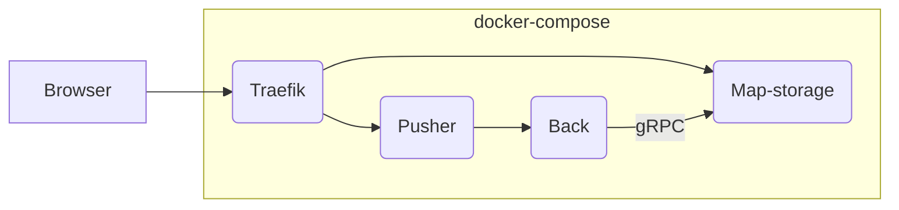

# Map-storage

The map-storage component is in charge of:

-   serving map files and assets to the game over HTTP
-   accepting uploads of new maps and assets (as a ZIP file)
-   editing the uploaded maps. The map-storage will receive edit messages from the back container directly.

> **Note**
> Maps do not have to be stored in the map-storage. They can be stored on any web server on the web and WorkAdventure
> can fetch them from this webserver. However, if you want to edit a map, you need to store the map in the map-storage.
> It is the only place where WorkAdventure has right accesses to edit a map.



## Uploading a demo map

By default, the map-storage container contains nothing.
You can upload a demo map using a simple command:

```bash
$ cd map-storage
$ npm run upload-test-map
```

> **Note:**
> This command only works for the dev environment and must be run out of the container.

This test map is accessible at http://play.workadventure.localhost/~/maps/areas.json

## Configuration

The map-storage currently supports 2 backends:

-   "disk" backend to store maps on the hard-drive of the map-storage
-   "S3" to store the maps in any Amazon S3-compatible storage

Configuration is done using environment variables.

If S3 related environment variables are found, map-storage will default to S3.
Otherwise, the `STORAGE_DIRECTORY` environment variable is used to find the root directory of the maps.

Note: in the Docker image, the `STORAGE_DIRECTORY` defaults to `/maps` at the root of the container.

Take a look at `src/Enum/EnvironmentVariables.ts` for a complete list of supported configuration parameters.

### Configuring authentication

The `/upload` endpoint MUST be protected by authentication.

As of now, the map-storage supports 3 mechanisms for authentication basic enough (there is no integration with third party systems yet).

-   Basic auth (with environment variable `ENABLE_BASIC_AUTHENTICATION=true`)
-   Digest auth (with environment variable `ENABLE_DIGEST_AUTHENTICATION=true`)
-   Bearer token (with environment variable `ENABLE_BEARER_AUTHENTICATION=true`)

If "Basic" or "Digest", you must use the `AUTHENTICATION_USER` and `AUTHENTICATION_PASSWORD` environment variable to pass the (only) valid user.

If "Bearer", you must use the `AUTHENTICATION_TOKEN` environment variable to set the (only, hard-coded) credential
or you can use the `AUTHENTICATION_VALIDATOR_URL` environment variable to set a remote URL used to validate the credential.

> **Note**
> Contributions are welcome to improve this. Behind the scene, we use "passport" to the authentication.

## API

### File upload

## Endpoints that require Authentication

Closed endpoints require // TODO

### Upload a map / a world

Upload files to the map-storage. Uploading is done in ZIP files.

**URL** : `/upload`

**Method** : `POST`

**Auth required** : YES

Parameters in POST must be passed with the `multipart/form-data` encoding.

Parameters:

-   **file** (compulsory): the uploaded ZIP file. Must not be encrypted.
-   **directory** (optional): the sub-directory we are performing the upload in.

If `directory` is not passed, upload is performed at the root of the storage directory ("/").

> **Warning**
> The `upload` endpoint will delete ALL files within `directory` before uploading new files.

**Response**:

-   200: OK
-   400: Validation error (for instance: invalid maps)
    **Sample:**
    ```json
    {
        "missing-image/MissingImage.tmj": [
            {
                "type": "error",
                "message": "Image of the tileset \"XXX\": \"xxx.png\" is not loadable.",
                "details": "",
                "link": ""
            }
        ]
    }
    ```
