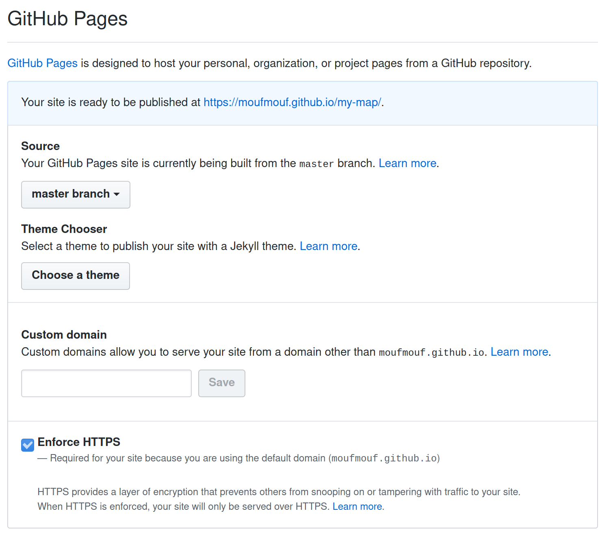

# WorkAdventure Map Starter Kit

This is a starter kit to help you build your own map for [WorkAdventure](https://workadventu.re).

## Tools you will need

In order to build your own map for WorkAdventure, you need:

- the [Tiled editor](https://www.mapeditor.org/) software
- "tiles" (i.e. images) to create your map (this starter kit provides a good default tileset for offices)
- a web-server to serve your map (this starter kit proposes to use Github static pages as a web-server which is both free and performant)

## Getting started

On the [Github repository page](https://github.com/thecodingmachine/workadventure-map-starter-kit),
click the **"Use this template"** button. You will be prompted to enter a repository name for your map.

Be sure to keep the repository "Public".

In your newly created repository, click on the **Settings tab** and scroll down to the **GitHub Pages** section.
Then select the **gh-pages** branch. 

Wait a few minutes a Github will deploy a new website with the content of the repository.
The address of the website is visible in the "GitHub Pages" section.

Click on the link. You should be redirected directly to WorkAdventure, on your map!

## Customizing your map

Your map is now up and online. You need to customize it.

### Cloning the map

Start by cloning the map. If you are used to Git and GitHub, simply clone the map
to your computer using your preferred tool and [jump to the next chapter](#loading-the-map-in-tiled).

If you are new to Git, cloning the map means downloading the map to your computer.
To do this, you will need Git, or a Git compatible tool. Our advice is to use
[GitHub Desktop](https://desktop.github.com/).

TODO: test and continue

### Loading the map in Tiled

The sample map is in the file `map.json`.
You can load this file in [Tiled](https://www.mapeditor.org/).

Now, it's up to you to edit the map and write your own map.

Some resources regarding Tiled:

- [Tiled documentation](https://doc.mapeditor.org/en/stable/manual/introduction/)
- [Tiled video tutorials](https://www.gamefromscratch.com/post/2015/10/14/Tiled-Map-Editor-Tutorial-Series.aspx)

### About WorkAdventu.re maps

In order to design a map that will be readable by WorkAdventure, you will have to respect some constraints.

In particular, you will need to:

- set a start position for the players
- configure the "floor layer" (so that WorkAdventure can correctly display characters above the floor, but under the ceiling)
- eventually, you can place exits that link to other maps

All this is described in the [WorkAdventure documentation](https://github.com/thecodingmachine/workadventure/#designing-a-map).
Please be sure to check it out. 

### Pushing the map

When your changes are ready, you need to "commit" and "push" the changes back to GitHub.
Just wait a few minutes, and your map will be propagated automatically to the GitHub pages web-server.

TODO: describe how to push
